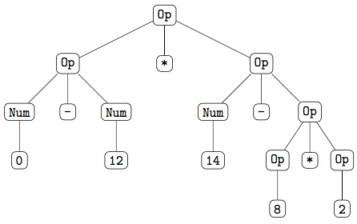
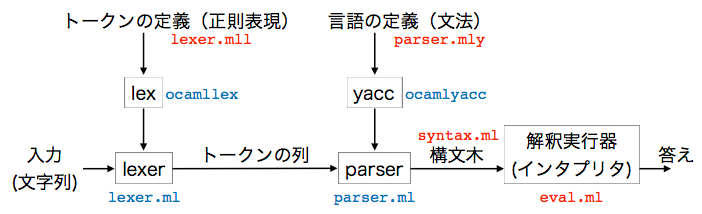

# 目次
{:.no_toc}

- TOC
{:toc}

# １章　はじめに

本書では、字句解析ツール lex の OCaml 版である
ocamllex、構文解析ツール yacc の OCaml 版である
ocamlyacc の使い方を解説します。

## 動機

ちょっとしたテキストベースのアドベンチャーゲームを作りたいとしましょう。
主人公は未知の世界に放り出され、ユーザのコマンドにしたがって冒険をします。
例えば「北に行く」というコマンドを入れたら北に進み、「鍵を取る」というコマンドを入れたら落ちている鍵を拾うといった要領です。
ゲームの構想を練っているときは、どのようなコマンドを用意しようか、それに対してどのように世界を変化させようか、全体のシナリオはどうしようかなど、想像はどんどん膨らむことでしょう。
ところが、いざゲームのプログラムを作ろうと思うと突き当たる問題があります。
それは、ユーザのコマンドをどのように受け付けるかという問題です。

最初に思いつくのは、番号を振ったコマンドの一覧を作っておき、ユーザにはその番号を入力してもらうというものです。
これなら、C 言語の `scanf` 程度の原始的な命令でも実装できそうです。
でも、これではどのようなコマンドを使えるのかがあらかじめわかってしまいます。
最終的に実装されるコマンドの数は有限ですが、それらを先に提示してしまうのではなく、使えるコマンドをユーザが少しずつ探しながらゲームを進める形にしたいところです。

このような形のゲームを作るためには、ユーザの入力したコマンドを何らかの方法で理解する必要があります。
しかし、これはそう簡単なことではありません。
例えば「北に行く」というコマンドひとつ取っても、色々な書き方があります。
ひらがなを使って「きたにいく」と入力するかも知れませんし、「北にいく」のように一部だけをひらがなにするかも知れません。
さらに、少し別の言葉を使って「北に進む」と入力するかも知れません。
内容的には「北に行く」というひとつのコマンドであるにも関わらず、ユーザの入力には様々なバリエーションがあるのです。

ここまで考えてくると、次第にアドベンチャーゲームを作るのが憂鬱になってきます。
ゲームのシナリオ部分に想像力を働かせたいと思っているのに、その手前の入力部分で時間を取られてしまうのです。
さらに、いったん入力部分が完成したとしても、新しいシナリオを思いつき、それを実現するために新たなコマンドが必要になれば、また入力部分で悩まされることになります。
そうではなく、入力部分に使えるコマンドをもっと簡単な形で記述することはできないのでしょうか。

## 字句解析と構文解析

入力文字列の解析方法は古くから研究されています。
特に、インタプリタやコンパイラなど言語処理系においては必須の技術です。
インタプリタやコンパイラは、まずユーザの書いたプログラムを解析し、どのようなプログラムが書かれているのかを理解します。
それに基づいて、インタプリタなら解釈実行して計算結果を提示し、コンパイラならコンパイル結果を出力します。

入力文字列の解析は典型的には２段階に分けられます。
まず行うのが**字句解析**です。
字句解析は、入力の文字列を意味のある塊ごとに分解します。
例えば「きたに行く」という５文字の入力であれば、最初に「きた」という名詞があり、次に「に」という助詞がきて、最後に「行く」という動詞がくるというように３つに分解されます。
最初の「きた」は、入力文字列的には「き」と「た」の２文字からなっていますが、字句解析を通るとそれは「きた」というひと塊のものとして認識されます。

字句解析の次に行われるのは**構文解析**です。
構文解析は、字句解析の結果、得られた単語の列が指定された文法にしたがっているかをチェックします。
例えば、「きたに行く」であれば文法にしたがっているけれども、「行くにきた」は文法にはしたがっていないと判定します。
構文解析はさらに、文法にしたがっていたときには**構文木**を返します。
構文木というのは、文法構造を木で示したものです。

このように入力文字列の解析は、字句解析と構文解析からなります。
これらの解析を通ると、入力が正しい単語（字句）のみを使っており、それらが文法に則った正しい順番に並んでいることが保証されます。
解析の結果、得られるのは構文木です。
構文木には入力文字列の表現する情報がすべて含まれており、この先の処理はこの構文木を使って行われることになります。
逆にいうと、構文木を得ることこそが字句解析・構文解析の目的です。

## lex と yacc

入力文字列の解析は字句解析・構文解析からなります。
これらを行うプログラムは、自分で作っても良いのですが、実はこれらを行うプログラムを自動生成するプログラムがすでに開発されています。
それが lex と yacc です。

字句解析を行うツールは **lex** と呼ばれます。
この名前は字句解析の英語 lexical analysis の先頭の３文字をとったものです。
このツールは、字句の定義を受け取ったら字句解析を行うプログラムを返します。
つまり、我々は字句解析を行うプログラムを書く必要はなく、単にどのような字句を使いたいのか、その定義を書きさえすれば良いのです。

例えば、アドベンチャーゲームで「北」「きた」「に」「行く」「進む」などの単語を使うとします。
その場合、字句の定義としてこれらの単語を指定しておけば、あとは lex がこれらの単語（のみ）を認識するような字句解析プログラムを生成してくれます。
我々に必要なのは、単に使用する単語（字句）を列挙することだけです。

一方、構文解析を行うツールは **yacc** と呼ばれます。
この名前は yet another compiler compiler の各単語の先頭の文字をつなげたものです。
このツールは、文法規則を受け取ったら構文解析を行うプログラムを返します。
つまり、我々は構文解析を行うプログラムを書く必要はなく、単に文法（と作成したい構文木の定義）を与えさえすれば良いのです。

例えば、アドベンチャーゲームでは、最初に方向を表す名詞がきて、次に助詞の「に」がきて、最後に「行く」などの動詞がくれば正しい文になります。
そして、入力文字列がこの文法にあっていたときには、方向を引数に持つ移動コマンドを表すデータ構造が欲しいとします。
その場合、この規則を文法の形で記述するとともに、移動コマンドのデータ定義を与えれば、あとは yacc がこの文法（のみ）を認識するような構文解析プログラムを生成してくれます。
我々に必要なのは、単に使用する文法と返すべき構文木の定義を記述することだけです。

## 本書の構成

本書では、簡単だけど完全な例として引き算電卓、もう少し毛色の違った例としてアドベンチャーゲーム、最後にもう少し大きな例として OCaml のコア言語を扱います。
それぞれについて、字句解析、構文解析がどのようにできるのか、実際にプログラムを示しながら説明します。

# ２章　引き算電卓
- この章で使用する[ファイル群]({{site.program-url}}/dentaku/)

この章では、引き算電卓を例にとって、字句解析・構文解析の完全な例を示します。
引き算電卓は小さな言語ですが、字句解析・構文解析によく使われる機能がたくさん現れます。
また、完全な例を手元に置いておくのは、とても役に立っていきます。
今後、自分で字句解析・構文解析を行うときは、まずこの例を眺めると良いでしょう。

## 対象言語

引き算電卓は、整数、引き算、掛け算、そして丸括弧のみからなる数式を受け付けます。
この先、引き算電卓に渡すことのできる数式を引き算言語と呼ぶことにします。

### 引き算言語で使われる字句（トークン）

引き算電卓で使われる字句は以下の５種類です。
以降では、これらの字句のことを**トークン**と呼びます。

- `(`, `)`
- `-`, `*`
- 整数（`0` から `9` までの数字が１個以上並んだもの）

以上に加えて `(*` 以降、行末までをコメントとします。
行末に `*)` と書けば OCaml のコメントと一致しますが、ここでは簡単のためそのチェックはしません。
OCaml のコメントのように `(*` と `*)`
が対応しており、さらに入れ子のコメントも許すようにする方法は[コメントの入れ子](#NestedComments)の節で述べます。

ここで、コメントの開始を示す `(*` はトークンには含まれないことに注意してください。
字句解析では `(*` を見たら行末までを単に無視します。
字句解析の段階でコメントをすべて入力から削除してしまい、最初から入力には書かれていなかったものとして扱います。

ここで述べたトークンの定義は、そのまま字句解析ファイル `lexer.mll` に書くトークンの定義に対応します。

### 引き算言語の文法

引き算言語の文法は以下のように定義されます。

```txt
<式> := <式> - <式> | <式> * <式> | - <式> | 整数 | ( <式> )
```

これで、引き算言語で許される入力 `<式>` は、右辺で示される５つの形式のいずれかであると読みます。

`<式>` のように `<...>` で囲まれた文法項目は、文法用語で**非終端記号**と呼ばれます。
非終端記号は変数と呼ばれることもありますが、本書ではプログラム中に出てくる変数と混同しないよう非終端記号という言葉を使います。
非終端記号は、その文法項目で許される入力を表します。
右辺に出てくる縦棒 `|` は「または」と読むとわかりやすいです。

最初の `<式> - <式>` は、２項演算の引き算を使いたいときには `-` の両側に式が来なくてはならないことを示しています。
次の `<式> * <式>` も同様です。
一方、`- <式>` は `-3` など、単項演算のマイナスを示しています。
最後の `( <式> )` は式全体を対応の取れた括弧でくくったものも式として認めることを示しています。

ここで述べた文法の定義は、そのまま構文解析ファイル `parser.mly` に書く文法規則に対応します。

### 例

例えば、

```txt
(* test *)
-12 * (14 - 8 * 2)
```

という入力があったとしましょう。
この入力には１行目の最後に改行、また２行目のあちこちにスペースが入っていることにも注意してください。
これを字句解析に通すと、まず１行目のコメントは捨てられ無視されます。
返ってくるトークンは、この順に `-`, `12`, `*`, `(`, `14`, `-`, `8`,
`*`, `2`, `)` の 10 個になります。
途中にあったスペースや改行はすべて無視されます。
`-12` は入力では間にスペースがありませんが、字句解析を通ると
`-` と `12` というふたつのトークンに分解されます。

このようにして得られたトークンの列を構文解析に通すと次のような構文木が得られます。
ここで `Op` は２項演算を、`Num` は整数を表しています。



`-12` は `0 - 12` に変換されています。
また `14 - 8 * 2` の部分では `-` よりも `*` が優先されていることがわかります。
さらに `(` と `)` は構文木には現れておらず、その代わりに構文木の形で優先順位が表現されています。

一方、トークンの定義には存在しない入力を受け取るとエラーになります。
例えば、

```txt
12 * 3 + 5
```

という入力を考えてみましょう。
これを字句解析に通すと `12`, `*`, `3`
までは正しく字句解析されますが、ここでトークンの定義には存在しない `+`
という入力が現れるため字句解析を続行できずエラーとなります。

また、使われているトークンは正しくても、それが文法に合っていないとエラーになります。
例えば、

```txt
12 - * 5
```

という入力は、正しく字句解析されて `12`, `-`, `*`, `5`
という４つのトークンが返りますが、その後の構文解析のところで `*`
の左側に正しい式が来ていないためエラーとなります。

## ファイルの構成

引き算電卓を作る際には、以下のファイルを用意します。

- `lexer.mll` 字句の定義
- `parser.mly` 文法の定義
- `syntax.ml` （抽象）構文木の定義
- `eval.ml` 入力された式の計算
- `main.ml` メインファイル

これらのファイルは以下のような関係になります。



字句の定義は `lexer.mll` というファイルに書きます。
`.mll` というのは ocamllex 用の拡張子です。
`lexer.mll` は ocamllex によって処理され、その結果 `lexer.ml` というファイルが作られます。
これが実際の字句解析を行うプログラムです。
字句解析を行うプログラムは**レクサ**とも呼ばれます。

文法の定義は `parser.mly` というファイルに書きます。
`.mly` というのは ocamlyacc 用の拡張子です。
`parser.mly` は ocamlyacc によって処理され、その結果 `parser.ml` というファイルが作られます。
これが実際の構文解析を行うプログラムです。
構文解析を行うプログラムは**パーザ**とも呼ばれます。

構文木の定義は `syntax.ml` というファイルに書きます。
ここに書かれた定義にしたがった構文木が構文解析の結果として出力されます。
字句解析・構文解析はメインファイル `main.ml` から呼び出されます。
その結果、構文木が得られたら、それを使って `eval.ml` で式の計算を行います。
引き算電卓なら、構文木に対応する数式を計算し答えを出力します。

`eval.ml` 以外は、どのようなプログラムでも似たような構成になります。
`eval.ml` は引き算電卓に特有の計算を行う関数が書かれるファイルで、作るプログラムが変わればその内容は大きく変わります。

以下、各ファイルについて具体的に説明していきます。

## 構文木の定義 {#Sugar}
- 使用ファイル：[syntax.ml]({{site.program-url}}/dentaku/syntax.ml)

引き算言語の文法には、単項のマイナスが含まれていました。
しかし、２項演算の引き算と単項のマイナスの両方があると、以降の電卓の計算をする際に両方を考えなくてはならずプログラムが煩雑になります。
引き算電卓の場合はこの違いはわずかですが、大きな言語になってくるとこれは大きな差になってきます。

そこで、単項のマイナスは構文解析の段階で２項演算の引き算を使うように変更します。
例えば、`-12` という入力があった場合は、それを内部で `0 - 12` に変換し、以降の処理では２項演算の引き算のみが現れるようにします。
このようにすると、以降の処理で単項のマイナスを考える必要がなくなり、少しプログラムが簡潔になります。

ユーザの入力には許されているけれども、内部的には他の構文に変換されるような構文のことを**糖衣構文**（**シンタクティックシュガー**）と呼びます。
構文解析を少し工夫するだけで、以降の処理を複雑にすることなくユーザは `-12` という簡潔でわかりやすい（甘くておいしい）構文を使うことができるというニュアンスです。

電卓の計算をする際、前節に示した引き算言語の文法にはもうひとつ簡略化できるところがあります。
それは括弧の規則です。
`14 - 8 * 2` と書けば引き算よりも掛け算が優先されますが、`(14 - 8) * 2` のように明示的に括弧を書くと引き算を先に行うことができます。
しかし、構文解析がすめば `(14 - 8) * 2` において引き算が先に結合していることは構文木の形から明らかになります。
そこで、電卓の内部で使用する構文木の定義からは括弧の規則も削除します。

結局、引き算電卓の内部で使う構文木には以下を使用します。

```txt
<式> := <式> - <式> | <式> * <式> | 整数
```

この定義は、そのまま構文木の定義 `syntax.ml` に書く型定義に対応します。

このように、電卓内部で使う構文木の定義は入力文字列を構文解析するときに使う構文木とは異なります。
電卓内部で使う構文木は、その後の処理では不要な情報が落とされ、簡潔な形になっています。
この構文木のことを**抽象構文木**（**Abstract Syntax Tree**, **AST**）と呼びます。
これに対応して、入力文字列を構文解析するときに使う構文木を**具象構文木**と呼ぶこともあります。

上の抽象構文木の定義は、そのまま OCaml の型定義に対応します。

```ocaml
(* ２項演算子の型 *)
type op_t = Minus | Times

(* Syntax.t: parser が出力する抽象構文木の型 *)
type t  = Num of int            (* 整数 *)
        | Op of t * op_t * t    (* ２項演算 *)
```

これが `syntax.ml` の中身です。
構文解析が済むと、その結果はここで定義される `Syntax.t` 型の値になります。
例えば、`(14 - 8) * 2` は最終的に

```ocaml
Op (Op (Num (14), Minus, Num (8)), Times, Num (2))
```

という構文木になります。

`syntax.ml` には、さらに以下の関数を追加しておきましょう。

```ocaml
(* 抽象構文木を文字列に変換する関数 *)
(* string_of_expr : Syntax.t -> string *)
let rec string_of_expr expr = match expr with
    Num (n) -> string_of_int n
  | Op (arg1, op, arg2) ->
      "(" ^ string_of_expr arg1
          ^ begin match op with
                Minus -> "-"
              | Times -> "*"
            end
          ^ string_of_expr arg2 ^ ")"

(* 抽象構文木を表示する関数 *)
(* Syntax.print : Syntax.t -> unit *)
let print expr =
  let str = string_of_expr expr
  in print_string str
```

`Syntax.print` は、抽象構文木を文字列に戻して表示する関数です。
これは、字句解析・構文解析をデバッグするときに役に立ちます。
抽象構文木を文字列として表示する際、２項演算に必ず括弧をつけるようにしていますので、どのような抽象構文木が作られたのかを知ることができます。

## 字句解析ファイル
- 使用ファイル：[lexer.mll]({{site.program-url}}/dentaku/lexer.mll)

最終的に作られる引き算電卓用の字句解析ファイル `lexer.mll` は以下のようになります。

```ocamllex
{
(* 補助的な変数、関数、型などの定義 *)
open Parser
}

(* 正規表現の略記 *)
(* [...] の中は character '...' でなくてはならない *)
let space = [' ' '\t' '\n' '\r']
let digit = ['0'-'9']
let lower = ['a'-'z']
let upper = ['A'-'Z']
let alpha = lower | upper

(* 字句解析の規則 *)
rule token = parse
| space+ { token lexbuf }       (* スペースは読み飛ばす *)
| "(*" [^ '\n']* "\n"           (* ( * から行末まではコメント *)
         { token lexbuf }
| "("    { LPAREN }
| ")"    { RPAREN }
| "-"    { MINUS }
| "*"    { TIMES }
| digit+                        (* 数字が１個以上 *)
         { NUMBER (int_of_string (Lexing.lexeme lexbuf)) }
| eof    { EOF }                (* 入力終了 *)
| _      { failwith ("unknown token: " ^ Lexing.lexeme lexbuf) }
```

このファイルは大きく分けて以下の３つの部分に分けられます。

1. 補助的な変数や関数、型の定義
1. 正規表現の略記
1. 字句解析の規則

以下、節を分けて順に説明していきます。

### 補助的な変数や関数、型の定義

字句解析ファイルの最初の部分は `{...}` でくくられている部分です。
ここでは以降の字句解析の中で使う補助的な変数や関数、型の定義などを行います。
ここには任意の OCaml の式を書くことができます。

ここには、典型的には上に示した `lexer.mll` のように `open Parser` とのみ書きます。
これは、字句解析で使うトークンの定義が構文解析を行う `Parser` モジュール（`parser.mly` の中）で定義されているからです。

引き算電卓では、`(`, `)`, `-`, `*`, 整数の５つのトークンを使用します。
これらは `parser.mly` の中でそれぞれ `LPAREN`, `RPAREN`, `MINUS`, `TIMES`,
`NUMBER` という名前で定義されています。
`parser.mly` で定義されているこれらのトークンを `lexer.mll` で使うためには
`Parser.LPAREN` のように各トークンの前に `Parser.` を付けなくてはなりません。
しかし、`lexer.mll` の先頭で `open Parser` と書いておくと、単にトークンの名前を書けばよくなります。

### 正規表現の略記

字句解析ファイルのふたつ目の部分は、正規表現の略記です。
ここには

```ocamllex
let 変数 = 正規表現
```

の形の定義を好きなだけ書くことができます。
このように書くと、右辺に書いた正規表現の代わりに左辺に書いた変数を使うことができるようになります。
上に示した `lexer.mll` では `space`, `digit`, `lower`, `upper`,
`alpha` の５つの変数を定義しています。
それぞれスペース、数字、小文字、大文字、アルファベットを示しています。

正規表現として書くことのできるものは以下です。

- **`'c'`**： `c` という character 一文字とマッチする。
特に `' ' ` はスペース、`'\t'` はタブ、`'\n'` は改行、`'\r'`
は復帰とマッチする。
- **`_`**： 任意の character 一文字とマッチする。
- **`eof`**： 入力の最後とマッチする。end of file の略。
- **`"str"`**： `str` という文字列とマッチする。
- **`[`** character の集合 **`]`**：
character の集合の中の一文字とマッチする。
character の集合は、character をスペースで区切って列挙する方法と、**`'0'-'9'`**
のように `-` で範囲を指定する方法がある。
後者の場合、ASCII 配列表で文字 `'0'` から `'9'` までのどれかという意味になる。
- **`[^`** character の集合 **`]`**：
character の集合に含まれない一文字とマッチする。
- 正規表現 **`*`**： 正規表現の 0 回以上の繰り返しとマッチする。
- 正規表現 **`+`**： 正規表現の 1 回以上の繰り返しとマッチする。
- 正規表現 **`?`**： 正規表現があってもなくても良いことを示す。
（正規表現 0 回、または 1 回とマッチする。）
- 正規表現1 **`|`** 正規表現2： 正規表現1 または正規表現2 にマッチする。
- 正規表現1 正規表現2： ふたつの正規表現の連接にマッチする。
（正規表現1 にマッチするものと正規表現2 にマッチするものをこの順にくっつけたものにマッチする。
このように正規表現を続けて書くと、それらを順にくっつけたものを表現できる。）
- 変数： 変数が定義する正規表現にマッチする。
- **`(`** 正規表現 **`)`**： 正規表現にマッチする。
（正規表現をグループ化するのに使う。
例えば `(alpha|digit)*`
は「アルファベット１文字または数字１文字」が任意個続いたものにマッチする。）

具体的に `lexer.mll` に定義されている変数を見てみましょう。

```ocamllex
let space = [' ' '\t' '\n' '\r']
```

`space` は、スペース、タブ、改行、または復帰のどれか一文字を示します。

```ocamllex
let digit = ['0'-'9']
let lower = ['a'-'z']
let upper = ['A'-'Z']
```

また、`digit` は 0 から 9 までの数字一文字、`lower` は小文字一文字、`upper`
は大文字一文字を示します。

```ocamllex
let alpha = lower | upper
```

最後に `alpha` は小文字一文字、または大文字一文字を示します。

### 字句解析の規則

字句解析ファイルの３つ目の部分は、字句解析の中心部分で、ここにはどのような文字列が来たらどのようなトークンを返すかを指定します。
この部分は

```ocamllex
rule token = parse
```

と書いた後に

```ocamllex
| 正規表現 { 返すべきトークン }
```

という形の規則を必要なだけ記述します。
このように書くと「この正規表現にマッチしたら `{...}` の中を実行してください」という意味になります。

上のような規則をたくさん書いておくと、字句解析の際にはこれらの規則を**すべて調べて入力と最も長くマッチするもの**が選ばれます。
このことを**最長マッチ**と言います。
同じ長さでマッチする正規表現が複数あった場合には、先に書かれているものが選ばれます。
そして、選ばれた正規表現の右側の `{...}` の中に書かれているトークンを返します。
`{...}` の中には、典型的には返すべきトークンのみを書きますが、必要ならここに任意の OCaml の式を書くことができます。

具体的に `lexer.mll` に書かれている字句解析の規則をひとつひとつ見ていきましょう。

```ocamllex
| space+ { token lexbuf }       (* スペースは読み飛ばす *)
```

ここに書かれている正規表現は「スペース、タブ、改行、または復帰」がひとつ以上続いたものにマッチします。
引き算電卓ではスペースやタブ、改行、復帰はすべて無視しますので、この正規表現にマッチしたときには、その入力は捨てることになります。
この「入力を捨てる」というのを示しているのが `token lexbuf` です。
ここの `token` は直前の行で

```ocamllex
rule token = parse
```

のように定義される `token` （という規則を表す関数）であり、`lexbuf`
は入力文字列を格納するバッファなのですが、これらについては理解する必要はありません。
単に `token lexbuf` と書いたら「マッチした入力を読み飛ばす」という意味になると覚えてください。

次の

```ocamllex
| "(*" [^ '\n']* "\n"           (* ( * から行末まではコメント *)
         { token lexbuf }
```

は `(*` から行末までにマッチします。
正規表現が複雑な形をしていますが、これは `"(*"`, `[^ '\n']*`, `"\n"`
という３つの正規表現を続けて書いたもの（連接）になっています。
ひとつ目の正規表現は `(*` という文字列そのものにマッチします。
ふたつ目の正規表現は `[^ '\n']` の部分が「改行以外の一文字」にマッチしますので、全体として「改行以外の文字を
0 回以上繰り返したもの」つまり「改行を含まない任意の長さの文字列」にマッチします。
そして最後の正規表現は改行にマッチします。
すると、全体として「`(*` から行末の改行まで」を示すことになります。
これは引き算電卓ではコメントの部分に相当しますので、`token lexbuf` として読み飛ばします。

```ocamllex
| "("    { LPAREN }
| ")"    { RPAREN }
| "-"    { MINUS }
| "*"    { TIMES }
```

これら４行が典型的な規則になります。
それぞれ正規表現のところに書かれた文字を見つけたら対応するトークンを返しています。

複数の文字からなる予約語の場合も同様で、その予約語を単にそのまま書き下すだけです。
例えば、入力中に余りを示す `mod` を許したかったら

```ocamllex
| "mod"  { MOD }
```

のように書きます。

```ocamllex
| digit+                        (* 数字が１個以上 *)
         { NUMBER (int_of_string (Lexing.lexeme lexbuf)) }
```

これは数字 `digit` が１個以上、続いた文字列にマッチします。
この場合は整数のトークンを返したいわけですが、整数のトークンを返すときには入力が整数であったことに加えて、実際にどの数だったのかの情報も必要です。
そのため `NUMBER` トークンは `int` 型の引数を取るようになっています。
（トークンの定義方法については次節の構文解析ファイルのところで述べます。）

`NUMBER` トークンに渡す引数は、ユーザが入力した数です。
その数は、ここでマッチした入力部分に書いてあります。
それを取ってきているのが `Lexing.lexeme lexbuf` です。
ここで `Lexing.lexeme` というのが入力バッファ `lexbuf`
の中のマッチした部分を取ってくる関数ですが、これについても理解する必要はありません。
`Lexing.lexeme lexbuf` と書いたら、マッチした部分の文字列を得ることができると覚えておいてください。

ただ、ここでひとつ注意があります。
`Lexing.lexeme lexbuf` で取ってこられるものはいつも文字列です。
例えば、入力が `12` であれば
`Lexing.lexeme lexbuf` で取ってこられるのは `"12"` という文字列になります。
一方、`NUMBER` トークンには `int` 型の値を渡したいので、`int_of_string`
を使ってそれを数に変換しています。

ここで、最長マッチについて触れておきましょう。
入力が `12` という２文字だった場合、`digit+` という正規表現は
`12` 全体ともマッチしますが、最初の `1` だけともマッチします。
最長マッチの言っていることは、ここで `1` だけとマッチして、入力が `1` という整数と `2` という整数の列であるというようには解釈しないということです。
なるべく長い入力とマッチするようになっているので、必ず `12` という整数と解釈されます。

```ocamllex
| eof    { EOF }                (* 入力終了 *)
```

この規則は入力が終了したときの規則です。
入力が終了したら `EOF` というトークンを返します。
この `EOF` というトークンも次節の構文解析ファイルで定義されています。

```ocamllex
| _      { failwith ("unknown token: " ^ Lexing.lexeme lexbuf) }
```

最後は、これまでの規則のどれともマッチしないような入力一文字がきたときの規則です。
この規則は必ず一番、最後に書かなくてはなりません。
`_` は任意の一文字を表しますが、同じ長さでマッチしたときには先に書かれた規則が使われるので、ここで `_` にマッチするのは、これまでのどの規則にも当てはまらなかった入力だけです。
そのような入力がきたときには、その一文字を `Lexing.lexeme lexbuf`
で取ってきて、それを含むエラー文を生成して終了します。

例えば `12 * 3 + 5` という入力であれば、`+`
を読み込んだところで

```txt
Fatal error: exception Failure("unknown token: +")
```

というエラーを起こして終了します。

## 構文解析ファイル
- 使用ファイル：[parser.mly]({{site.program-url}}/dentaku/parser.mly)

最終的に作られる引き算電卓用の構文解析ファイル `parser.mly` は以下のようになります。

```ocamlyacc
%{
(* 補助的な変数、関数、型などの定義 *)
%}

/* トークンの定義 */    /* 以降、コメントが C 式になることに注意 */
%token LPAREN RPAREN
%token MINUS TIMES
%token <int> NUMBER     /* これは、整数には int 型の値が伴うことを示す */
%token EOF              /* End of File: 入力の終わりを示す */

/* エントリーポイント（開始記号）の定義 */
%start start

/* 非終端記号の型をここで宣言する */
%type <Syntax.t> start

/* 演算子の優先順位を指定する */
/* 下に行くほど強く結合する */
%left MINUS
%left TIMES
%nonassoc UNARY
/* nonassoc は結合なし（毎回、括弧が必要）、left は左結合、right は右結合 */

/* 以下の %% は省略不可。それ以降に文法規則を書く */
%%

start:
| expr EOF               { $1 }

simple_expr:
| NUMBER                 { Syntax.Num ($1) }
| LPAREN expr RPAREN     { $2 }

expr:
| simple_expr            { $1 }
| expr MINUS expr        { Syntax.Op ($1, Syntax.Minus, $3) }
| expr TIMES expr        { Syntax.Op ($1, Syntax.Times, $3) }
| MINUS expr %prec UNARY { Syntax.Op (Syntax.Num (0), Syntax.Minus, $2) }
```

このファイルは大きく分けて以下の３つの部分に分けられます。

1. 補助的な変数や関数、型の定義
1. 各種の定義と宣言
1. 構文解析の規則（文法）

以下、節を分けて順に説明していきます。

### 補助的な変数や関数、型の定義

構文解析ファイルの最初の部分は `%{ ... %}` でくくられている部分です。
ここでは以降の構文解析の中で使う補助的な変数や関数、型の定義などを行います。
ここには任意の OCaml の式を書くことができます。

上に示した `parser.mly` ではこの部分には何も書いていませんが、文法を記述する部分で `Syntax` モジュールをよく使うので `open Syntax` を入れておいても構いません。

### 各種の定義と宣言

構文解析ファイルのふたつ目の部分には、以下の４つを書きます。

1. トークンの定義
1. エントリーポイント（開始記号）の指定
1. 非終端記号の型の指定
1. 演算子の結合規則と優先順位の指定

ここの部分では、コメントが OCaml 式の `(* ... *)` ではなく
C 言語式の `/* ... */` になることに注意してください。
これは、内部で C 言語用の yacc を呼び出して処理しているためだと思われます。

#### トークンの定義

次のように `%token` の後に使いたいトークンを書きます。
トークンは OCaml の構成子になるので大文字で始まる必要があります。
慣例で、トークンは２文字目以降もすべて大文字にすることが多いようです。

```ocamlyacc
%token LPAREN RPAREN
%token MINUS TIMES
%token <int> NUMBER     /* これは、整数には int 型の値が伴うことを示す */
%token EOF              /* End of File: 入力の終わりを示す */
```

１行に複数のトークンを書いても良いですし、複数の `%token` 文を書いても構いません。
トークンに引数を持たせる場合には、引数の型を `<...>` の中に書きます。
引数を持つトークンは、同じ型の引数を持つものは同じ行にまとめて書くことができますが、違う型の引数を持つトークンは行を分ける必要があります。

#### エントリーポイント（開始記号）の指定

文法のエントリーポイント（入り口）になる非終端記号を `%start` で指定します。
エントリーポイントは、文法用語では**開始記号**と呼ばれます。

```ocamlyacc
/* エントリーポイント（開始記号）の定義 */
%start start
```

引き算言語の文法には非終端記号が `<式>` しか現れませんでしたが、文法によっては多くの非終端記号を使用します。
その中から、入力文字列がどの非終端記号の文法にしたがうべきなのかを指定します。
上の指定では `start` という名前の非終端記号をエントリーポイントにしています。

エントリーポイントは `%start` の指定を増やす、あるいは `%start` に複数の非終端記号を指定することで複数作ることができます。
エントリーポイントがひとつの場合は、`start` という名前の非終端記号にしておくとわかりやすいようです。

#### 非終端記号の型の指定

入力文字列が文法にしたがっていた場合、文法中の各非終端記号は対応する構文木を返します。
ここでは各非終端記号がどのような型の構文木を返すかを `%type` で指定します。
非終端記号の型は ocamlyacc が推論してくれるので、ほとんどの非終端記号についてこの型指定は不要ですが、エントリーポイントの非終端記号だけは型指定が必要です。

```ocamlyacc
/* 非終端記号の型をここで宣言する */
%type <Syntax.t> start
```

ここでは、エントリーポイント `start` の型を
`Syntax` モジュール（`syntax.ml`
の中）に定義されている抽象構文木の型 `Syntax.t` に指定しています。
指定する型は `<...>` で囲みます。

#### 演算子の結合規則と優先順位の指定

最後に演算子の結合規則と優先順位を指定します。
引き算電卓では２項演算子として `-` と `*` が出てきます。
両方の演算子が出てきた場合は、括弧で明示的に優先順位が示されていない限り
`*` を先に計算します。
しかし、引き算言語の文法を見ると `-` と `*` は対等に扱われていて優先順位は指定されていません。

```txt
<式> := <式> - <式> | <式> * <式> | - <式> | 整数 | ( <式> )
```

これは `14 - 8 * 2` と書いたら `14 - (8 * 2)` だけでなく `(14 - 8) * 2`
のように解釈されてしまう可能性もあるということを示しています。

さらに、同じ演算子でも `17 - 5 - 3`
のように複数、出てきたときには問題を生じます。
`(17 - 5) - 3` とも `17 - (5 - 3)` とも解釈できてしまうからです。
ここでは前者を選びたいところです。

このように文法に曖昧性がある場合、それを何とか解消して、意図する構文木を生成できるようにしなくてはなりません。
曖昧性解消のひとつの方法が結合規則と優先順位の指定です。

結合規則というのは、同じ演算子が使われていた場合、左右どちらを優先するかを示します。
**左結合**では先に出てくる（左側の）演算子を優先し、**右結合**では後に出てくる（右側の）演算子を優先します。
上記の `17 - 5 - 3` の場合、`-` が左結合なら 
`(17 - 5) - 3` と解釈され、右結合なら
`17 - (5 - 3)` と解釈されます。

結合規則の指定は `%left` と `%right` で行います。
前者が左結合、後者が右結合です。
例えば `-` は左結合して欲しいので

```ocamlyacc
%left MINUS
```

と指定します。
同様に `*` も左結合して欲しいので

```ocamlyacc
%left TIMES
```

と指定します。

場合によっては左結合も右結合もして欲しくない場合があります。
その場合は `%nonassoc` を使います。
`%nonassoc` を指定された２項演算子は、必ず括弧を明示的に書いて曖昧性を解消しなくてはなりません。
例えば `-` が `%nonassoc` と指定されていたら、
`17 - 5 - 3` と書くと曖昧性が解消できないため構文エラー (syntax error) となります。

一方、優先順位は、異なる演算子が使われていた場合、どちらの演算子を優先するかを示します。
優先順位は、結合規則を書く順番で指定します。
後に書いたものほど優先順位が高くなります。
例えば、引き算電卓の例では

```ocamlyacc
/* 演算子の優先順位を指定する */
/* 下に行くほど強く結合する */
%left MINUS
%left TIMES
```

となっています。
`TIMES` の結合規則の方が後に書かれていますので、これは `TIMES` の方が
`MINUS` よりも優先されることを示しています。
これを

```ocamlyacc
%left MINUS TIMES
```

のようにまとめて書くのは誤りです。
これだと `-` と `*` が同じ優先順位になってしまい、例えば 
`14 - 8 * 2` は（どちらも左結合の演算子なので）`(14 - 8) * 2` と解釈されてしまうことになります。

逆に、同じ優先順位のものは同じ行に記述します。
例えば `-` と同じ優先順位の `+` があったとしたら

```ocamlyacc
%left MINUS PLUS
```

と指定します。
これで `-` と `+` が両方出てくるような式では、左側に出てきた演算子が先に結合することになります。
なお、結合規則の異なる演算子を同じ優先順位に指定することはできません。
そのようなことが必要になる場面は存在しないと思われます。

`parser.mly` の結合規則と優先順位の指定のところには、さらに最後に次の行が書かれています。

```ocamlyacc
%nonassoc UNARY
```

この `UNARY` というのは、単項のマイナスの優先順位を指定するためだけに使われるトークン（のようなもの）です。
この行は一番、最後に書かれていますので一番、優先順位は高くなります。
これは、単項のマイナスを２項演算子の `-` や `*` よりも強く結合させるために使われます。
これについては、文法規則のところで説明します。

なお、優先順位を指定するためだけに使われるトークンは `%token` であらかじめ宣言しておく必要はありません。
２項演算ではないので `%nonassoc` を指定していますが、このトークンに結合規則が必要になることはないので、何を指定しても構いません。

### 構文解析の規則（文法）

構文解析ファイルの３つ目の部分は、構文解析の中心部分で、ここには文法規則（構文の定義）と対応するアクションを記述します。
この部分は、最初に `%%` と書き、その後に文法規則を書いていきます。
この `%%` は省略できず、必ず書く必要があります。

文法規則は、各非終端記号の生成規則からなります。
それぞれの生成規則は次の形をしています。

```ocamlyacc
非終端記号:
| シンボルの列 { 返すべき構文木 }
| シンボルの列 { 返すべき構文木 }
| ...
```

ここでシンボルは、トークンか非終端記号のどちらかです。
上のような生成規則を書くと、これで「非終端記号」を読み込もうとしているときに、示されているシンボルの列がきたら、`{...}`
の中に書かれている構文木を返す、という意味になります。
`{...}` は、この生成規則の**アクション**と呼ばれます。
そこで返される構文木が、この非終端記号の値となります。

`{...}` の中には、任意の OCaml の式を書くことができますが、典型的には返すべき構文木を書きます。
その際、シンボルが値を持つ場合には、それらを `$1`, `$2` などで参照できます。
ここで数字は何番目のシンボルかを示しています。
シンボルが引数付きのトークンだった場合は、引数の値がトークンの値になります。
引数を持たないトークンには値は存在せず、`$1` などでアクセスしようとするとエラーになります。

生成規則は少し複雑ですので、具体的に見ていきましょう。

```ocamlyacc
start:
| expr EOF               { $1 }
```

最初の生成規則は、エントリーポイントである `start` の規則です。
この場合は、単に `<式>` を表す非終端記号 `expr`
を読み込みにいき、その後 `EOF`
がきたら、つまりこれ以上、余計な入力がなく、入力が終了したら
`start` を読み込めたことにしています。
このように、エントリーポイント用の非終端記号は主となる文法とは別に作り、読み込みたいものに続いて
`EOF` と書いておくようにするのがすっきりする傾向にあるようです。

さて、`start` を読み込めたときに返すもの（アクション）には `$1`
と書かれています。
これは、シンボルの列の中の１番目のものの値を示しています。
今、シンボルの列は `expr` と `EOF` のふたつからなります。
そのひとつ目の `expr` の値が `start` の値ということになります。
下で述べますが、`expr` は `<式>` を読み込んだときに、対応する構文木を返します。
この規則は、その構文木をそのまま `start` の値とする、ということを表しています。

なお、ここでは `$2` を使うことはできません。
`$2` は `EOF` の値を指すことになりますが、`EOF`
は引数を持たず値がないためエラーとなります。

```ocamlyacc
simple_expr:
| NUMBER                 { Syntax.Num ($1) }
| LPAREN expr RPAREN     { $2 }
```

次の生成規則は `simple_expr` の規則です。
前に引き算言語の文法を示したときは `<式>`
という非終端記号のみを使っていましたが、ここでは `<式>`
を表す `expr` 以外に `simple_expr` という非終端記号を使っています。
これは、これ以上、分解されない「アトミックな式」を表します。

引き算電卓では、わざわざ `expr` と `simple_expr`
を分ける必要は必ずしもないのですが、後に言語を拡張して関数呼び出しをできるようにすると、アトミックな式は「関数呼び出しの引数になることができる式」を表すようになります。
`3` や括弧のついた `(5 - 3)` は関数 `f` の引数になれるけれども、
括弧のない `5 - 3` は関数 `f` の引数にすると `f 5 - 3` となり、これは
`(f 5) - 3` と解釈したいので `5 - 3` は関数
`f` の引数にはなれないということです。
が、ここでは深入りせず、`simple_expr`
は、これ以上、分解できない式と解釈しておいてください。

`simple_expr` は、ふたつの規則からできています。
最初の規則は、入力が `12` などの `NUMBER` だった場合です。
この場合は整数を表す構文木を返したいのでアクションは
`Syntax.Num ($1)` とします。
ここで `$1` はひとつ目の `NUMBER` の値を示します。
`NUMBER` は `int` 型の引数を持つように宣言したので、その値が `$1` に入ります。

ふたつ目の規則は、シンボルの列が `LPAREN`, `expr`, `RPAREN`
の３つからできています。
これは、入力が `( <式> )` の形だった場合です。
最初に開き括弧 `(` を読み込み、続いて式 `expr`
を読み込み、最後に閉じ括弧 `)`
を読み込めたら、外側の括弧が対応していることを確認できています。
結果として `( <式> )`
の形の入力を読み込めたので、`$2`
の値、つまりふたつ目のシンボルである `expr`
の値（構文木）を全体の値として返しています。

この規則では括弧の対応だけを確認して、返すものは
`expr` に対応する構文木 `$2` だけであることに注意してください。
`expr` に対応する構文木を作ることで、すでに括弧の役割は終わっているので、
ここに括弧があったという情報は捨てて `expr`
に対応する抽象構文木のみを返しています。

`EOF` のときと同様に、ここでも `$1` を使うことはできません。
`$1` は `LPAREN` の値を指すことになりますが、`LPAREN`
は引数を持たず値がないためエラーとなります。

```ocamlyacc
expr:
| simple_expr            { $1 }
| expr MINUS expr        { Syntax.Op ($1, Syntax.Minus, $3) }
| expr TIMES expr        { Syntax.Op ($1, Syntax.Times, $3) }
| MINUS expr %prec UNARY { Syntax.Op (Syntax.Num (0), Syntax.Minus, $2) }
```

最後に `expr` の規則です。
これは引き算言語で許される式を表現しています。
最初の行は `simple_expr` を読み込めたら、それは `expr` としても認めるということを示しています。
その値は `simple_expr` の値である `$1` になります。

２行目と３行目は、それぞれ引き算、掛け算だった場合です。
再帰的に２項演算子の両側に式 `expr` を探しにいき、それらが両方とも見つかったら２項演算の構文木を返します。
左の式は `$1`、右の式は `$3` になります。
両側の `expr` はそれぞれ、どのような式にもなり得ることに注意してください。
このようにして入れ子構造になった式を構文解析します。

最後の行は単項のマイナスがきた場合です。
`MINUS` に続いて `expr` を読み込めたら `0` から `expr` の値を引くという構文木を返します。
ここが、[糖衣構文](#Sugar)である単項のマイナスを２項演算のマイナスに置き換えている部分です。
単項のマイナスの場合、`expr` は２番目に現れますので、その値は `$2` になります。

ここではさらに `%prec UNARY` という優先順位の指定が行われています。
このように、シンボルの列の最後には `%prec`
と優先順位を示すトークンをつけることができます。
これは、この規則の優先順位を
`%prec` の後に書かれている `UNARY` の優先順位にしてくださいという意味です。

優先順位のところで `UNARY` は `-` や `*`
よりも優先順位が高いと宣言しました。
つまり、単項のマイナスは２項演算の `-` や `*`
よりも強く結合するということです。
例えば `-12 * 3` となっていたら `(-12) * 3`
と解釈し、`-(12 * 3)` とは解釈しないということです。
掛け算の場合はどちらでも同じですが、引き算の場合は結果が異なってきます。
`-12 - 3` は `(-12) - 3` と解釈され、誤って `-(12 - 3)`
となってしまうのを避けています。

## メインファイル
- 使用ファイル：[main.ml]({{site.program-url}}/dentaku/main.ml)

プログラム全体の入り口となるメインファイル `main.ml` は以下のようになります。

```ocaml
(* メイン関数 *)
let go () =
  let expr = Parser.start Lexer.token (Lexing.from_channel stdin) in
  (* これで標準入力を字句解析して、構文解析した結果を expr に入れ *)
  print_string "Parsed : ";
  Syntax.print expr;            (* 入力を表示する *)
  print_newline ();
  print_string "Result : ";
  print_int (Eval.f expr);      (* 計算結果を表示する *)
  print_newline ()

(* スタートアップ *)
let _ = go ()
```

関数 `go` の１行目にある

```ocaml
  let expr = Parser.start Lexer.token (Lexing.from_channel stdin) in
```

の部分が字句解析・構文解析を行なっている部分です。
ここで `Parser.start` の `start`
は構文解析のところで指定した開始記号の名前です。
開始記号として指定した非終端記号のみを外から使うことができます。
関数 `Parser.start`
は、引数として使用する字句解析器 `Lexer.token`
と、どこから入力を読み込むかの指定 `Lexing.from_channel stdin`
を受け取ると、字句解析・構文解析を行った結果を返します。
したがって、上の１行を書くだけで `expr` に抽象構文木が得られます。

`Lexer.token` に現れる `token` という変数は、字句解析のところで `rule`
の次に書いた変数名と対応していますが、ほとんどの場合、この名前を変更する必要はないので、いつもこのように書くと思っておいて構いません。

`Lexing.from_channel stdin` は、入力文字列を標準入力 `stdin`
から受け取るということを指定しています。
`stdin` を他のファイルディスクリプタにすれば、入力文字列をファイルから読み込むようにすることもできます。
また、直接、文字列 `"..."` を字句解析・構文解析したいときには
`Lexing.from_string "..."` と書くこともできます。

字句解析・構文解析がすんだら、その先は引き算電卓に必要な処理を書いていきます。
上に示した `main.ml` の例では、字句解析・構文解析の結果得られた抽象構文木を表示した後、`Eval.f` で数式の計算を行い、結果を表示しています。
`Eval.f` については次の節で説明します。

最後に、次の呼び出しでプログラムを開始します。

```ocaml
(* スタートアップ *)
let _ = go ()
```

## 引き算電卓の処理
- 使用ファイル：[eval.ml]({{site.program-url}}/dentaku/eval.ml)

抽象構文木を受け取って、実際に引き算電卓に必要な計算を行うのが
`eval.ml` です。
`eval.ml` は以下のようになります。

```ocaml
open Syntax

(* 実際の計算をする関数 *)
(* Eval.f : Syntax.t -> int *)
let rec f expr = match expr with
    Num (n) -> n
  | Op (arg1, op, arg2) ->
      let v1 = f arg1 in
      let v2 = f arg2 in
      begin match op with
          Minus -> v1 - v2
        | Times -> v1 * v2
      end
```

単に得られた抽象構文木の構造にしたがって再帰的に計算しているだけです。
入力文字列の理解に必要な単語の区切りや演算子の優先順位といった情報が、すべて抽象構文木に反映されているため、ここでは抽象構文木を見さえすれば十分です。
これが字句解析・構文解析の威力です。
入力文字列の解析とその後の処理を分離し、あたかも入力が初めからこのような構造を持っているかのように捉えることができるようになるのです。

引き算電卓の計算をする関数 `Eval.f` はとても簡単ですが、`Eval.f`
は小さいながらも引き算言語のインタプリタと考えることができます。
これを拡張していくと、プログラミング言語のインタプリタを作ることができます。
実際、OCaml インタプリタは、その規模は大きく異なりますが、字句解析・構文解析を経た後に入力プログラムを実行するように書かれており、基本的な構造は引き算電卓と同じです。

## コンパイルの方法

この節では、これまでに説明してきたファイルをコンパイルして実行する方法を示します。

### 自分でコンパイルする方法

```txt
ocamllex lexer.mll
```

を実行すると `lexer.mll` がコンパイルされて、字句解析プログラム
`lexer.ml` が生成されます。同様に

```txt
ocamlyacc parser.mly
```

とすると `parser.mly` がコンパイルされて、構文解析プログラム
`parser.ml` と `parser.mli` が生成されます。
`parser.mli` には、`parser.mly`
に書かれているトークンの定義が入っています。
`lexer.ml` は、この `parser.mli` からトークンの定義を読み込むようになっています。

これ以外のファイルのコンパイル法は、通常の
OCaml プログラムのコンパイルと同じです。
依存関係にしたがって、必要なものから順に
`ocamlc -c` でコンパイルします。

引き算電卓の場合は以下のようになります。

```txt
ocamlc -c syntax.ml
ocamlc -c parser.mli
ocamlc -c parser.ml
ocamlc -c lexer.ml
ocamlc -c eval.ml
ocamlc -c main.ml
```

最後にリンクします。

```txt
ocamlc -o dentaku syntax.cmo parser.cmo lexer.cmo eval.cmo main.cmo
```

これで `dentaku` という名前の実行ファイルができました。
実際に使ってみましょう。
```txt
$ ./dentaku
(* test *)
-12 * (14 - 8 * 2)
Parsed : ((-12)*(14-(8*2)))
Result : 24
```

標準入力から計算したい数式を入力します。
最後に入力終了を示す `ctrl-D`（`control` を押しながら `d`）を押すと、構文解析の結果と計算結果が表示されます。

### dune を使う方法
- 使用ファイル：[dune]({{site.program-url}}/dentaku/dune)

ビルドツールである dune を使うと、いちいちコンパイルするコマンドを順に打たなくても、一気にすべてコンパイルしてくれます。
dune を使うには以下のような dune という名前のファイルを用意します。

```txt
(executable
 (name main))
(ocamllex lexer)
(ocamlyacc parser)
```

ここで２行目の `main` というのが、引き算電卓のメインファイル `main.ml`
から拡張子を取り除いたものです。
このように指定するだけで、あとは dune が `main.ml`
をコンパイルするのに必要なファイルを自動的に探し出してコンパイルしてくれます。
ただし、字句解析ファイルと構文解析ファイルだけは別途、コンパイル方法を指示してあげなくてはなりません。
それが後ろの２行です。
ここに出てくる `lexer`, `parser` はそれぞれ `lexer.mll`, `parser.mly`
の拡張子を取り除いたものです。

上のような `dune` ファイルを用意しておくと、コンパイルは以下のように行えます。

```txt
dune build main.exe
```

生成される実行ファイルは `_build/default/main.exe` となります。
実行するには `_build/default/main.exe`
を呼び出せば良いのですが、以下のようにしても実行できます。

```txt
dune exec ./main.exe
```

現在のディレクトリに `main.exe` があるわけではありませんが、
`main.exe` の前の `./` は必須です。

### OCamlMakefile を使う方法
- 使用ファイル：[Makefile]({{site.program-url}}/dentaku/Makefile)

昔から使われている `make` を使ってコンパイルするには
OCamlMakefile を使うのが便利です。
それには以下のような Makefile という名前のファイルを作ります。

```makefile
SOURCES = syntax.ml parser.mly lexer.mll eval.ml main.ml
RESULT = dentaku
OCAMLMAKEFILE = OCamlMakefile
include $(OCAMLMAKEFILE)
```

ここで `SOURCES` の行にはソースファイルを依存関係の順番にスペースで区切って並べます。
引き算電卓の場合は、`Syntax.t` 型が `parser.mly` の中で使われているので先頭に、
`parser.mly` はトークンの定義が `lexer.mll` で使われているので２番目に、
`main.ml` は他のすべてのファイルを参照しているので最後に書きます。

`RESULT` の行には、コンパイルした結果を格納するファイル名を記します。
`OCAMLMAKEFILE` は OCamlMakefile が置かれている場所を自分の環境に合わせて書きます。
４行目はいつもこのように書いてください。

以上のような `Makefile` を用意したら `make` と打つことでコンパイルできます。
実行ファイルは `RESULT` に指定した `dentaku` というファイルになります。
実行するには `./dentaku` としてください。

# ３章　shift/reduce conflict
- この章で使用する[ファイル群]({{site.program-url}}/dentaku/)

アドベンチャーゲームに進む前に、この章では文法が曖昧だったときの対処法のひとつを紹介します。
初めて本書を読むときには、この章は一旦、後回しにして、先に次のアドベンチャーゲームの章に進んでも構いません。

前の章で示した引き算電卓の文法は、同じ演算が複数回、出てきたときにどちらを優先するのか、また異なる演算が現れたときにどちらを優先するのかなど、曖昧性がありました。
引き算電卓では、２項演算子の結合規則と優先順位を指定することでその曖昧性を避けていました。
ここでは、そもそも文法が曖昧なのかどうかを判断する方法と、曖昧だったときの対処法のひとつを紹介します。

## 文法が曖昧かどうかのチェック

文法が曖昧かどうかは `parser.mly` をコンパイルする際のメッセージでわかります。
`parser.mly` を

```txt
ocamlyacc parser.mly
```

のようにコンパイルした際、何もメッセージが出ずにコンパイルが終了したら、文法は曖昧ではありません。
一方、文法が曖昧だと

```txt
17 shift/reduce conflicts.
```

のような警告メッセージが出ます。
このようなメッセージが出たら、必ずその原因を探り、文法の曖昧性を解消しましょう。
曖昧性を解消しないまま使うと、入力文字列が意図とは異なる形で構文解析されてしまうことがあります。

文法が曖昧であることがわかったら、次に

```txt
ocamlyacc -v parser.mly
```

のように `-v` というオプションをつけてコンパイルし直します。
この `-v` というオプションは、**構文解析表**を出力せよ、という意味です。
すると、文法がどのように処理されるのかを記した構文解析表が `parser.output` という名前のテキストファイルに作られます。
このファイルを見ながら曖昧性を解消します。

## 構文解析表の読み方 {#ParserOutput}
- 使用ファイル：[parser-conflict1.mly]({{site.program-url}}/dentaku/parser-conflict1.mly),
[parser-conflict1.output]({{site.program-url}}/dentaku/parser-conflict1.output)

具体的に曖昧な文法の例を見てみましょう。
前の章で作った `parser.mly` から優先順位の指定

```ocamlyacc
%left MINUS
%left TIMES
%nonassoc UNARY
```

を削除し、さらに `%prec` を使っている `expr` の単項のマイナスの規則からも優先順位の指定を削除して次のようにします。

```ocamlyacc
| MINUS expr             { Syntax.Op (Syntax.Num (0), Syntax.Minus, $2) }
```

この状態で `ocamlyacc` を使ってコンパイルすると、次のような警告メッセージが出ます。

```txt
6 shift/reduce conflicts.
```

この警告メッセージは、文法中に shift 動作をするべきか reduce 動作をするべきか曖昧なところが６ヶ所あったという意味です。
このような警告メッセージが出たら、`ocamlyacc` に `-v` オプションをつけてコンパイルし直します。
すると `parser.output` という構文解析表がテキストファイルの形で生成されます。

`parser.output` が生成されたら、その中から conflict と書かれている部分を探します。
ここで扱っている例では、以下の各部分にそれぞれ２ヶ所ずつ、合計６ヶ所の
conflict が記述されています。

```txt
10: shift/reduce conflict (shift 11, reduce 7) on MINUS
10: shift/reduce conflict (shift 12, reduce 7) on TIMES
state 10
	expr : expr . MINUS expr  (5)
	expr : expr . TIMES expr  (6)
	expr : MINUS expr .  (7)

	MINUS  shift 11
	TIMES  shift 12
	RPAREN  reduce 7
	EOF  reduce 7
```

これが最初のふたつの conflict の記述です。
これは次のように読みます。

最初の行は、状態 10 で `MINUS` というトークンが来ると shift/reduce conflict が起きると報告しています。
次の行は、状態 10 で `TIMES` というトークンが来ても shift/reduce conflict が起きると報告しています。

状態 10 は、そのすぐ下の `state 10` というところに書かれています。
ここにはまず、中に `.` の含まれた文法規則が書かれています。
この `.` は、構文解析を行っている際の「現在の位置」を示しています。
例えば、最初の (5) と書かれた規則は「今、最初の `expr` は読み込み終わり、次にまさに `MINUS` というトークンが来ることを期待している状態」を表しています。
この状態で `MINUS` を読み込み、さらに `expr` を読み込めれば `expr MINUS expr` を読み込めたことになるので、全体として `:` の左辺に示される `expr` を読み込めることになります。

shift/reduce conflict が起きたときは、最初の conflict を報告している行の reduce で指定された規則に着目します。
上の例では、１行目の括弧の中に `reduce 7` と書いてあるので、(7) と書かれた３つ目の文法規則に着目します。
ここで指定される規則は、必ず `.` が文法規則の一番最後に来ています。
指定される規則が複数ある場合は、その中に必ず `.` が最後に現れる規則があります。

規則 (7) は `MINUS` を読み込み、さらに `expr` も読み込み終わった状態を示しています。
すでに `MINUS` と `expr` を読み込んでいるので、全体として `expr` を読み込んだと解釈して良さそうなものです。
しかし、ここで最初の conflict の記述のところに書かれている `MINUS` あるいは `TIMES` というトークンが来ると

- `MINUS expr` の読み込みが終了したとして、これ全体を `expr` とする (reduce) のか
- さらに次のトークンの読み込みを続けて (shift)、別の構文木を作るのか

の間で曖昧性が生じます。
これが shift/reduce conflict です。

より具体的に考えてみましょう。
今、`- <式> - <式>` という入力の最初の `- <式>` までを読み込んだところだとします。
このとき、最初の `- <式>` の部分をまとめて（reduce 動作をして）構文木を作り、もとの入力を `(- <式>) - <式>` と解釈するのか、さらに先を読み込んで（shift 動作をして）その先の構文木を作り、もとの入力を `- (<式> - <式>)` と解釈するのかで曖昧性があるということです。
この状況を、現在の位置を `.` で表して

- `MINUS <式> . MINUS <式>`

と書くことにしましょう。
`- <式> * <式>` という入力の場合も同様です。
こちらの状況は

- `MINUS <式> . TIMES <式>`

と書けます。
このように、conflict が起きたときは具体的な入力でどのような曖昧性が生じているのかを考えることができます。

状態 10 の記述は、上記の文法規則に続いて次のようになっています。

```txt
	MINUS  shift 11
	TIMES  shift 12
	RPAREN  reduce 7
	EOF  reduce 7
```

これは、状態 10 で各入力が来たときに、どのような動作をするかを示しています。

最初の行は `MINUS` が来た場合で、このときは状態 11 に shift すると書かれています。
今 `MINUS` が来たときは shift する以外にも (7) の規則を使って reduce するという選択肢もありました。
ですが、ocamlyacc は shift/reduce conflict が起きた場合、必ず shift する方を選択します。
つまり、ここで生成された構文解析器をこのまま使うと、
`- <式> - <式>` という入力は
`- (<式> - <式>)` と解釈されるということです。
これは、望まれる結果ではないので手を打つ必要があります。

`TIMES` も同様です。
一方、`RPAREN` や `EOF` が来たときは `reduce 7` と書かれています。
これは (7) の規則で reduce することを示しています。

他の conflict も見ておきましょう。

```txt
15: shift/reduce conflict (shift 11, reduce 5) on MINUS
15: shift/reduce conflict (shift 12, reduce 5) on TIMES
state 15
	expr : expr . MINUS expr  (5)
	expr : expr MINUS expr .  (5)
	expr : expr . TIMES expr  (6)

	MINUS  shift 11
	TIMES  shift 12
	RPAREN  reduce 5
	EOF  reduce 5
```

ここでも `MINUS` と `TIMES` で shift/reduce conflict が起きています。
conflict を報告している行の括弧の中を見ると `reduce 5` と書かれているので、(5) の文法規則を見ます。
(5) の規則はふたつ書かれていますが、このうち必要なのは `.` が最後に来ている規則です。

```txt
	expr : expr MINUS expr .  (5)
```

この状態で `MINUS` または `TIMES` が来ると conflict を起こします。
それぞれ

- `<式> MINUS <式> . MINUS <式>`
- `<式> MINUS <式> . TIMES <式>`

という状況で、前後、どちらを先にまとめるべきかで曖昧性が生じています。

最後のふたつの conflict は以下です。

```txt
16: shift/reduce conflict (shift 11, reduce 6) on MINUS
16: shift/reduce conflict (shift 12, reduce 6) on TIMES
state 16
	expr : expr . MINUS expr  (5)
	expr : expr . TIMES expr  (6)
	expr : expr TIMES expr .  (6)

	MINUS  shift 11
	TIMES  shift 12
	RPAREN  reduce 6
	EOF  reduce 6
```

これは

- `<式> TIMES <式> . MINUS <式>`
- `<式> TIMES <式> . TIMES <式>`

という状況です。

## 結合規則による曖昧性の解消

前の節で示した conflict をまとめると以下のようになります。

- `MINUS <式> . MINUS <式>`
- `MINUS <式> . TIMES <式>`
- `<式> MINUS <式> . MINUS <式>`
- `<式> MINUS <式> . TIMES <式>`
- `<式> TIMES <式> . MINUS <式>`
- `<式> TIMES <式> . TIMES <式>`

この節では、この中で `MINUS` のみが出てくる conflict、つまり最初と３番目の conflict を解消します。

ひとつのトークンのみ（あるいは優先順位が同じトークンのみ）が現れる場合の conflict は、結合規則を指定することで解消できます。
具体的には、優先順位の指定のところで

```ocamlyacc
%left MINUS
```

とすれば左結合するようになります。
これは、shift/reduce conflict で reduce の方を選択したことになり、上の conflict を起こしている状態を、それぞれ

- `(MINUS <式>) MINUS <式>`
- `(<式> MINUS <式>) MINUS <式>`

と解釈します。
一方、

```ocamlyacc
%right MINUS
```

とすれば右結合するようになります。
これは、shift/reduce conflict で shift の方を選択したことになり、上の conflict を起こしている状態を、それぞれ

- `MINUS (<式> MINUS <式>)`
- `<式> MINUS (<式> MINUS <式>)`

と解釈します。

ここでは `MINUS` を左結合させたいので `%left MINUS` と指定します。
この１行のみを指定して、再び ocamlyacc でコンパイルすると shift/reduce conflict の数が４つに減ります。

## 優先順位による曖昧性の解消
- 使用ファイル：[parser-conflict2.mly]({{site.program-url}}/dentaku/parser-conflict2.mly),
[parser-conflict2.output]({{site.program-url}}/dentaku/parser-conflict2.output)

`MINUS` の結合規則を指定すると、残る shift/reduce conflict は以下の４つになります。

- `MINUS <式> . TIMES <式>`
- `<式> MINUS <式> . TIMES <式>`
- `<式> TIMES <式> . MINUS <式>`
- `<式> TIMES <式> . TIMES <式>`

このうち、最後の conflict は `TIMES` の結合規則を指定すれば解消できます。
`TIMES` も左結合したいので、`%left TIMES` とします。

一方、それ以外の３つは `MINUS` と `TIMES` の両方が出てきます。
`MINUS` と `TIMES` では、`TIMES` を優先したいので優先順位が異なります。
このような場合は、演算子の優先順位を指定することで曖昧性を解消します。
次のように優先順位を設定します。

```ocamlyacc
/* 演算子の優先順位を指定する */
/* 下に行くほど強く結合する */
%left MINUS
%left TIMES
```

このように設定すると、次のように動作します。

- すでに読み込んでいる演算子の優先順位より、これから読み込もうとしている優先順位が高い場合は、後者を優先するために shift する。
- すでに読み込んでいる演算子の優先順位より、これから読み込もうとしている優先順位が低い場合は、前者を優先するために reduce する。

以上で、上の conflict しているケースのうちの後ろ３つは以下のように解釈されます。

- `<式> MINUS (<式> . TIMES <式>)`
- `(<式> TIMES <式>) . MINUS <式>`
- `(<式> TIMES <式>) . TIMES <式>`

最初のふたつの conflict では、いずれも優先順位の高い `TIMES`
が優先され、最後の conflict では左側の `TIMES` が優先されています。

## %prec による優先順位の変更

`TIMES` の結合規則と優先順位を指定すると、実は６つすべての conflict が解消します。
しかし、ここで少し気をつけなければなりません。
`MINUS` よりも `TIMES` の方が強く結合すると設定したため、次の conflict のケース：

- `MINUS <式> . TIMES <式>`

は

- `MINUS (<式> TIMES <式>)`

のように解釈されてしまっています。
この conflict に限っては、どちらに解釈しても電卓の計算結果は変わらないので問題ないと考えることもできます。
しかし、いつも問題ないとは限りません。

上のケースで `MINUS <式>` を優先したい場合は、reduce される規則の優先順位を `%prec` を使って変更します。
具体的には、まず優先順位の指定のところで

```ocamlyacc
/* 演算子の優先順位を指定する */
/* 下に行くほど強く結合する */
%left MINUS
%left TIMES
%nonassoc UNARY
/* nonassoc は結合なし（毎回、括弧が必要）、left は左結合、right は右結合 */
```

のように `UNARY` を定義します。
その上で、それを単項のマイナスの規則で `%prec` を使って指定します。

```ocamlyacc
| MINUS expr %prec UNARY { Syntax.Op (Syntax.Num (0), Syntax.Minus, $2) }
```

このようにすると 
`MINUS <式>`
の優先順位が `MINUS` ではなく `UNARY` となります。
その結果、上で conflict していたケースは `UNARY` の優先順位を持つ `MINUS <式>` が `TIMES` よりも優先されて

- `(MINUS <式>) TIMES <式>`

と解釈されるようになります。

## shift/reduce conflict における ocamlyacc の動作

ここで、shift/reduce conflict が起きたときに ocamlyacc がどのように動作するのかをまとめておきます。
まず、次の規則を使います。

- reduce すべき文法規則と次に読み込んでくるトークンの優先順位を比べ、優先順位の高い方を優先する。

ここで、文法規則の優先順位は `%prec` で指定されていたらその優先順位、指定されていなかったら「一番、右にあるトークン」の優先順位になります。
例えば

```txt
	expr : expr MINUS expr .  (5)
```

の文法規則の優先順位は `MINUS` になります。
文法規則の優先順位と次に読み込んでくるトークンの優先順位が等しい場合は、次の規則を使います。

- トークンの結合性が `%left` なら reduce し、`%right` なら shift し、`%nonassoc` ならエラーを起こす。

文法規則と次に読み込んでくるトークンの片方、あるいは両方の優先順位・結合規則が指定されていない場合は、次の規則を使います。

- shift を選択し、その旨の警告メッセージを出す。

ただし、この最後の規則に依存した文法規則を書くのは好ましくありません。
shift/reduce conflict が出たときには、shift を選ぶのが良い場合でも、きちんと優先順位・結合規則を指定して、警告メッセージが出ないようにしましょう。

# ４章　アドベンチャーゲーム
- この章で使用する[ファイル群]({{site.program-url}}/game/)

この章では、簡単なテキストベースのアドベンチャーゲームを例にとって、その字句解析・構文解析がどのようになるのかを紹介します。
本書で説明をするのは字句解析・構文解析の部分のみで、ゲームの実装については触れません。
ですが、ゲームの実装部分もそれほど難しくはないので、興味のある方はソースコード中の
`main.ml`
を解読してみてください。

できあがるアドベンチャーゲームは以下の URL から遊ぶことができます。
まずは、これで少し遊んでみてください。
ゲームをクリアしたときには、明確にクリアしたことがわかるようになっています。

[https://kenichi-asai.github.io/lex-yacc/assets/program/game/game.html][1]

[1]: https://kenichi-asai.github.io/lex-yacc/assets/program/game/game.html

このゲームの特徴は、入力するコマンドの自由度が大きいことです。
任意の文を理解するとはいきませんが、でも、一見、普通の言葉を理解しているかのような錯覚を覚えます。
これはどのように実装されているのでしょうか。
実は、これも適切に字句解析・構文解析を行うことで実現されています。
以下ではそれをみていきます。

## 対象言語

アドベンチャーゲームでは「北に行く」「鍵を取る」などのコマンドを入力しました。
この節では、アドベンチャーゲームがどのようなコマンドを受け付けるのか、言い換えるとアドベンチャーゲームがどのような言語を認識するのかを規定します。
引き算電卓のときと同様に、字句と文法の定義を示します。

### 使われる字句（トークン）

アドベンチャーゲームで使われるのは以下の単語です。
品詞ごとに分けて書いていますが、字句解析で品詞の知識を使うわけではないので、分けて書いていることには読みやすくしている以上の意味はありません。

- **名詞**： `東`, `ひがし`, `西`, `にし`, `南`, `みなみ`, `北`, `きた`,
`家`, `いえ`, `部屋`, `へや`, `鍵`, `かぎ`,
`ドア`, `扉`, `とびら`, `サボテン`, `宝`, `たから`
- **助詞**： `へ`, `に`, `から`, `を`
- **動詞**： `進む`, `すすむ`, `行く`, `いく`, `入る`, `はいる`,
`出る`, `でる`, `取る`, `とる`,
`置く`, `おく`, `開く`, `ひらく`, `閉じる`, `とじる`,
`ノックする`, `終了する`, `しゅうりょうする`

アドベンチャーゲームで使う単語は全角文字のみでできているとします。
また、コマンドは短いものしか扱わないので、複数行にまたがることはなく、必ず１行で書くことにします。

上に示した単語群が入力文字列として受け付けられるものですが、これらの中には同じものを表している単語が多くあります。
例えば `東` と `ひがし` は同じですし、
`ドア`, `扉`, `とびら` も同じものでしょう。
また、
`進む`, `すすむ`, `行く`, `いく`
も使っている動詞は異なりますが、同じものを表していると考えられます。

そこで、字句解析が返すトークンはこれらの単語すべてを区別するのではなく、同じ単語はひとつにまとめることにします。
すると、字句解析が返すトークンは以下のようになります。

- **名詞**： `東`, `西`, `南`, `北`,
`家`, `部屋`, `鍵`,
`ドア`, `サボテン`, `宝`
- **助詞**： `へ`, `に`, `から`, `を`
- **動詞**： `進む`, `入る`,
`出る`, `取る`,
`置く`, `開く`, `閉じる`,
`ノックする`, `終了する`

`ひがし` などの単語は `東` の一種の[糖衣構文](#Sugar)ととらえて字句解析の段階で `東`
に変換してしまいます。

引き算電卓のときと同様、ここで述べたトークンの定義は、そのまま字句解析ファイル
`lexer.mll` に書くトークンの定義に対応します。

### 文法

アドベンチャーゲームで使われる文法は以下のように定義されます。

```txt
<文>　　　  := <方向> <方向助詞> 進む
　　　　　　| 家 <方向助詞> 入る
　　　　　　| 家 から 出る
　　　　　　| 部屋 から 出る
　　　　　　| <目的語> <他動詞>
　　　　　　| <単独動詞>
<方向>　　  := 東 | 西 | 南 | 北
<方向助詞>  := へ | に
<目的語>　  := <アイテム> を
<アイテム>  := 鍵 | ドア | サボテン | 宝
<他動詞>　  := 取る | 置く | ノックする | 開く | 閉じる
<単独動詞>  := 終了する
```

引き算電卓の文法に出てくる非終端記号は `<式>`
のみでしたが、ここでは７つの非終端記号を使っています。
ユーザが入力するコマンドとして認められるのは `<文>`
のみですが、それ以外にも `<方向>` や `<他動詞>`
など別の非終端記号（文法項目）を定義しています。

`<文>` の最初の規則は、`<方向> <方向助詞> 進む`
の形の入力がきたら `<文>` として認めるということを示しています。
ここで `<方向>` は `東`, `西`, `南`, `北`
の４種類、`<方向助詞>` は `へ` か `に`
のどちらかです。
したがってこれで合計８通りの文が受け付けられることになります。

`<他動詞>` は直前に `<目的語>` がくる必要があります。
`<目的語>` は `<アイテム> を` の形をしており、
`<アイテム>` としては 
`鍵`, `ドア`, `サボテン`, `宝`
が許されます。
また `<単独動詞>` は、文字通りそれだけで文を構成できる動詞です。

引き算電卓のときと同様、ここで述べた文法の定義は、そのまま構文解析ファイル
`parser.mly` に書く文法規則に対応します。

### 例

例えば `きたに行く` という全角で５文字の入力は、字句解析で `きた`,
`に`, `行く` の３つに分解されます。
そして `きた` は `北` というトークンに、`行く` は `進む`
というトークンにそれぞれ変換されて、結局 `北`, `に`, `進む`
という３つのトークンになります。

次に、構文解析に通すと `北` は `<方向>` と認識され、`に`
は `<方向助詞>` と認識されます。
その結果、`北`, `に`, `進む` は `<方向> <方向助詞> 進む`
の形になるので、正しい文であると判定されます。

## ファイルの構成

アドベンチャーゲームを作る際には、以下のファイルを用意します。

- `lexer.mll` 字句の定義
- `parser.mly` 文法の定義
- `syntax.ml` （抽象）構文木の定義
- `main.ml` メインファイル

最初の３つのファイルの役割は引き算電卓のときと同じです。
引き算電卓のときと異なり、ゲームの処理をする関数はメインファイルに入れてあります。
ユーザのコマンドがゲーム中に何度も入力されるため、字句解析・構文解析もゲームのメインループの中から呼び出すようにしています。

以下、各ファイルについて具体的に説明していきます。

## 抽象構文木の定義
- 使用ファイル：[syntax.ml]({{site.program-url}}/game/syntax.ml)

引き算電卓の章で、入力文字列を構文解析した結果は具象構文木を返すのではなく、必要な情報のみを抽出した抽象構文木を返すようにすると説明しました。
アドベンチャーゲームでも同様に、抽象構文木を定義して、それを構文解析の結果として返すようにします。

アドベンチャーゲームの抽象構文木は `syntax.ml` で以下のように定義されます。
（最初の `Error` という例外は、構文解析中に起きるエラーを表しています。
これについては構文解析のところで触れます。）

```ocaml
(* 構文解析中のエラー *)
exception Error of string

(* Syntax.t : parser が出力する抽象構文木の型 *)
type t = Idousuru of string             (* 移動する *)
       | Tadoushi of string * string    (* 他動詞 *)
       | Tandokudoushi of string        (* 単独動詞 *)
```

アドベンチャーゲームの文法は引き算電卓の文法と比べると複雑でしたが、抽象構文木の定義はとても簡潔なものになっています。
ユーザの入力するコマンドには色々な種類のものがありましたが、ここではそれを次の３つにまとめています。

- `Idousuru` コマンドは移動を表しています。
引数として方向を文字列で持っています。
方向には `"東"`, `"西"`, `"南"`, `"北"` に加えて、家への出入りを示す
`"出"`, `"入"` も含まれます。
`北に進む` も `家から出る` もこのコマンドを使って、それぞれ
`Idousuru ("北")`, `Idousuru ("出")` のように表現します。
（考えているアドベンチャーゲームでは、出入りする対象が家しかないので、家の情報は落としています。
また、`部屋から出る` も `家から出る` と同じと解釈されています。）
- `Tadoushi` コマンドは他動詞を表しています。
引数としてそれぞれ文字列で表現された目的語と動詞を持っています。
例えば `鍵を取る` は `Tadoushi ("鍵", "取る")` となります。
- `Tandokudoushi` は単独動詞を表しています。
考えているアドベンチャーゲームでは、単独動詞は `終了する` しかないので、引数を取る必要はありませんが、将来、別の単独動詞を使いたくなるかも知れないことを見越して、引数に動詞を文字列として持っています。
例えば `終了する` は `Tandokudoushi ("終了する")` となります。

## 字句解析ファイル
- 使用ファイル：[lexer.mll]({{site.program-url}}/game/lexer.mll)

アドベンチャーゲーム用の字句解析ファイル `lexer.mll`
の内容を順に見ていきましょう。

```ocamllex
{
(* 補助的な変数、関数、型などの定義 *)
open Parser

(* 字句解析中のエラー *)
exception Error of string
}
```

最初の部分では、トークンを `Parser.` なしで使えるようにするための
`open Parser` に加えて、字句解析中に起こるエラーを表す例外を定義しています。
ここで定義した例外は、`lexer.mll` の中だけでなく、メインファイルの中でも
`Lexer.Error` という名前で参照することができます。

次は、正規表現の略記です。

```ocamllex
(* 正規表現の略記 *)
(* [...] の中は character '...' でなくてはならない *)
let zenkaku1 = ['\224'-'\239']
              (* 0xE0 - 0xEF, UTF-8 の３バイト文字の１文字目 *)
let zenkaku = zenkaku1 _ _
```

アドベンチャーゲームでは全角文字を使います。
本書で紹介するアドベンチャーゲームでは使用しないのですが、
任意の全角文字一文字を表す `zenkaku` を紹介しています。
`zenkaku1` は UTF-8 で書かれた漢字の１バイト目の文字コードの範囲です。
これを使って `zenkaku` は `zenkaku1` で始まる任意の３バイトにマッチします。
２文字目、３文字目の `_` は、任意の１バイトを意味しています。
３バイトにしているのは、UTF-8
の全角文字（のほとんど）が３バイトでできているからです。

字句解析の規則は次のようになります。

```ocamllex
(* 字句解析の規則 *)
rule token = parse
| "東" | "ひがし"                      { HOUKOU ("東") }
| "西" | "にし"                        { HOUKOU ("西") }
| "南" | "みなみ"                      { HOUKOU ("南") }
| "北" | "きた"                        { HOUKOU ("北") }
| "家" | "いえ"                        { IE }
| "部屋" | "へや"                      { HEYA }
| "へ"                                 { HE }
| "に"                                 { NI }
| "から"                               { KARA }
| "進む" | "すすむ" | "行く" | "いく"  { SUSUMU }
| "入る" | "はいる"                    { HAIRU }
| "出る" | "でる"                      { DERU }
| "を"                                 { WO }
| "鍵" | "かぎ"                        { ITEM ("鍵") }
| "ドア" | "扉" | "とびら"             { ITEM ("扉") }
| "サボテン"                           { ITEM ("サボテン") }
| "宝" | "たから"                      { ITEM ("宝") }
| "取る" | "とる"                      { TADOUSHI ("取る") }
| "置く" | "おく"                      { TADOUSHI ("置く") }
| "開く" | "ひらく"                    { TADOUSHI ("開く") }
| "閉じる" | "とじる"                  { TADOUSHI ("閉じる") }
| "ノックする"                         { TADOUSHI ("ノックする") }
| "終了する" | "しゅうりょうする"      { TANDOKUDOUSHI ("終了する") }
| eof                                  { EOL }
| _
        { (* 字句解析できなかった部分をエラーとして例外を起こす *)
          let input = Bytes.to_string lexbuf.Lexing.lex_buffer in (* 入力全体 *)
          let pos = Lexing.lexeme_start lexbuf in (* マッチした先頭の位置 *)
          let str = String.sub input pos (String.length input - pos) in
          raise (Error ("「" ^ str ^ "」？")) }
```

最初の規則を見ると `"東"` と `"ひがし"` のふたつの正規表現が書かれています。
これで、どちらかにマッチしたら、という意味になります。
この場合は `HOUKOU ("東")` というトークンを返しています。
その先の規則も同様です。
`"進む"` と `"行く"` のところを見ると、どちらでも同じ `SUSUMU`
が返っています。
このようにして表現の揺らぎを吸収しています。

`eof` だった場合は、引き算電卓のときとは違って `EOL` を返しています。
これは enf of line の略です。
アドベンチャーゲームの場合は、コマンドは必ず１行以内なので
end of file ではなく end of line にしてみました。

最後の `_` は、登録されていない単語だった場合です。
この場合は、例外 `Error` をあげています。
引数に渡している `"「" ^ str ^ "」？"` の `str`
は直前に定義しており、「認識できなかった文字以降、入力の終わりまで」を表しています。

`str` の定義は、詳しく述べると次のようになります。
`lexbuf.Lexing.lex_buffer` にはユーザの入力した文字列全体が `Bytes.t`
というバイト列を表す型で入っています。
これを `Bytes.to_string` で `string` 型に変換して `input`
に入れ、その `pos` 文字目から `input` の最後までの
`String.length input - pos` 文字分を `String.sub` で切り出して
`str` に入れています。
ここで `pos` は `Lexing.lexeme_start lexbuf`
と定義されていますが、これでマッチした先頭の位置（つまり、登録されていなかった単語の先頭の位置）を示します。

このような `str` の前後にかぎ括弧をつけ、最後に `"？"`
をつけた文字列を `Error` の引数としています。
例えば、`北に向かって走る` という入力だったら `向かって走る`
の部分が認識できないので、`"「向かって走る」？"`
という文字列が `Error` の引数になります。
これをメインファイルの方で表示するようにすると、ユーザは `北に`
までは受け付けられたけれども、その先で受け付けられなかったという情報を読み取ることができます。

最後のケースは少し複雑でしたが、基本的には使いたい単語を並べ、対応するトークンを書くだけで `lexer.mll` を書けていることがわかります。

## 構文解析ファイル
- 使用ファイル：[parser.mly]({{site.program-url}}/game/parser.mly)

次に、アドベンチャーゲーム用の構文解析ファイル `parser.mly`
の内容を順に見ていきます。

```ocamlyacc
%{
(* 補助的な変数、関数、型などの定義 *)
open Syntax
%}
```

最初の部分は引き算電卓のときと同様ですが、文法を記述する部分で `Syntax` モジュールをよく使うので `open Syntax` を入れておきました。
構文解析でも、字句解析と同様、エラーを起こすことがあるので、ここにさらに

```ocaml
(* 構文解析中のエラー *)
exception Error of string
```

というのを加えて、メインファイルから `Parser.Error`
という名前で参照したかったところです。
しかし、構文解析ファイルの場合、ここの部分に書いた宣言は `parser.mly`
の中でのみ有効で、他のファイルからは参照することができません。
そのため、先に示した `syntax.ml` の中に構文解析用の `Error`
を宣言しました。
`parser.mly` では代わりにそれを使うことにします。

```ocamlyacc
/* トークンの定義 */    /* 以降、コメントが C 式になることに注意 */
%token <string> HOUKOU ITEM TADOUSHI TANDOKUDOUSHI
                        /* これらには string 型の値が伴うことを示している */
%token IE HEYA HE NI KARA SUSUMU HAIRU DERU WO
%token EOL              /* EOL = End Of Line 入力の終わり */

/* エントリーポイント（開始記号）の定義 */
%start start

/* 非終端記号の型をここで宣言する */
%type <Syntax.t> start
```

次に使用するトークンを定義します。
アドベンチャーゲームでは `HOUKOU`, `ITEM`
など複数のトークンが文字列の引数を持ちます。
ここではそれらを１行にまとめて書いています。

アドベンチャーゲームには演算子は出てこないので、結合規則や優先順位の指定はでてきていません。

```ocamlyacc
/* 入力の文法：

文　　　  = 方向 方向助詞 "進む"
　　　　  | "家" 方向助詞 "入る"
　　　　  | "家" "から" "出る"
　　　　  | "部屋" "から" "出る"
　　　　  | 目的語 他動詞
　　　　  | 単独動詞
方向　　  = "東" | "西" | "南" | "北"
方向助詞  = "へ" | "に"
目的語　  = アイテム "を"
アイテム  = "鍵" | "ドア" | "サボテン" | "宝"
他動詞　  = "取る" | "置く" | "ノックする" | "開く" | "閉じる"
単独動詞  = "終了する"

出力：Syntax.t 型の値

*/
```

続いて、コメントとして構文解析の入力の文法と出力の型を `parser.mly`
の中に書いておきました。
これはコメントなので必須ではありませんが、このように明示しておくと後で見返したときのわかりやすさが変わってきます。

ここに書いた文法規則のうち、方向、アイテム、他動詞、単独動詞については、字句解析のところですでにそれぞれ
`HOUKOU`, `ITEM`, `TADOUSHI`, `TANDOKUDOUSHI`
という引数付きのトークンになっています。
したがって、文法規則として定義しなくてはならないのは文、方向助詞、目的語になります。

次に文法規則を示します。

```ocamlyacc
/* 以下の %% は省略不可。それ以降に文法規則を書く */
%%

start:
| bun EOL
        { $1 }
```

`start` の中身は、すぐ次に定義されている `bun` と `EOL` になっています。
引き算電卓のときは `EOF`
でしたが、アドベンチャーゲームでは入力が１行のみなので `EOL`
にしています。

```ocamlyacc
bun:
| HOUKOU houkoujoshi SUSUMU
        { Idousuru ($1) }
| IE houkoujoshi HAIRU
        { Idousuru ("入") }
| IE KARA DERU
        { Idousuru ("出") }
| HEYA KARA DERU
        { Idousuru ("出") }
| mokutekigo TADOUSHI
        { Tadoushi ($1, $2) }
| TANDOKUDOUSHI
        { Tandokudoushi ($1) }

houkoujoshi:
| HE
        { () (* 何も返す必要がない *) }
| NI
        { () (* 何も返す必要がない *) }

mokutekigo:
| ITEM WO
        { $1 }
```

文法規則は見ての通りです。
`SUSUMU`, `HAIRU`, `DERU` だった場合には `Idousuru` を、`TADOUSHI`
なら `Tadoushi` を、`TANDOKUDOUSHI` なら `Tandokudoushi`
を返しているだけです。
`家から出る` と `部屋から出る` がどちらも同じ `Idousuru ("出")`
に変換されていることがわかります。
`houkoujoshi` は `HE` と `NI`
ですが、これらは入力文に存在していさえすれば良く、それが確認できれば特に値を返す必要はありません。
そこで `()` を返すようになっています。

方向助詞は、それを表すトークンにしてしまって、方向やアイテムなどと同様に字句解析のところで処理してしまうこともできます。
このように字句解析と構文解析の役割分担については絶対の規則があるわけではなく、よりわかりやすい方を選ぶことになります。

## 手動のエラー処理

前の節で示した `parser.mly`
は、ユーザが正しいコマンドを入力してくれれば解析結果の抽象構文木を返します。
しかし、ユーザはいつも正しいコマンドを書くとは限りません。
字句解析では、単語として認められないものが入力されたら、その部分から行末までをユーザに示すようにしました。
構文解析でも「正しい単語を使っているが、構文として正しくない」ような場合があり、何らかの対処をする必要があります。

紹介しているアドベンチャーゲームでは、ユーザにどのようなコマンドが使えるのかも試行錯誤の上、探ってもらうことにしています。
何もエラー処理をしないと、構文が正しくなかったときに（他の情報なしで）単に
`Parsing.Parse_error` というエラーが起こります。
そうではなく、ユーザの入力したコマンドが、どこまで通じてどこから通じなくなったのかをユーザに示してあげたいところです。

ここではそれを実現するために、`parser.mly` の文法に手動でエラーの規則を加えます。
具体的には `bun` と `mokutekigo` の生成規則を変更します。
`bun` の生成規則は次のように変更します。

```ocamlyacc
bun:
| HOUKOU houkoujoshi SUSUMU
        { Idousuru ($1) }
| HOUKOU houkoujoshi error
        { raise (Error ("「" ^ $1 ^ "に」どうする？")) }
| HOUKOU error
        { raise (Error ("「" ^ $1 ^ "」にどうする？")) }
| IE houkoujoshi HAIRU
        { Idousuru ("入") }
| IE houkoujoshi error
        { raise (Error ("「家に」どうする？")) }
| IE KARA DERU
        { Idousuru ("出") }
| IE KARA error
        { raise (Error ("「家から」どうする？")) }
| IE error
        { raise (Error ("「家」にどうする？")) }
| HEYA KARA DERU
        { Idousuru ("出") }
| HEYA KARA error
        { raise (Error ("「部屋から」どうする？")) }
| HEYA error
        { raise (Error ("「部屋」にどうする？")) }
| mokutekigo TADOUSHI
        { Tadoushi ($1, $2) }
| mokutekigo error
        { raise (Error ("「" ^ $1 ^ "を」どうする？")) }
| TANDOKUDOUSHI
        { Tandokudoushi ($1) }
|
        { raise (Error ("え？")) }
```

多くの規則が加わっていますが、どれも定型的な形をしていますので、最初の
`HOUKOU` から始まる規則を見てみましょう。
ここは、これまで

```ocamlyacc
| HOUKOU houkoujoshi SUSUMU
        { Idousuru ($1) }
```

だけだったところに

```ocamlyacc
| HOUKOU houkoujoshi error
        { raise (Error ("「" ^ $1 ^ "に」どうする？")) }
```

が加わりました。
ここで `error` というのは任意のトークン列を表す特別な非終端記号で、他の文法規則では構文解析できなかったときに不要なトークンを読み飛ばすのに使われます。
上に加わった新しい規則は、`HOUKOU`, `houkoujoshi`, `SUSUMU`
を読み込もうとしているところ、`HOUKOU`, `houkoujoshi`
までは読み込めたけど、そこで入力が終わってしまった、あるいは
`SUSUMU` 以外のトークン（列）が来てしまったことを示しています。
例えば、入力が `北に` で終わっている場合や `北に開く`
など後ろに意味の通らないトークンが来た場合です。
この場合は `北に`
までは読み込めているので、そのことを伝えるために「北に」をかぎ括弧にくくって
`"「北に」どうする？"`
というエラーメッセージを返します。

同様に次の

```ocamlyacc
| HOUKOU error
        { raise (Error ("「" ^ $1 ^ "」にどうする？")) }
```

は `HOUKOU` までは読み込めたけど、そのあとに方向助詞以外のトークン（列）が来た場合です。
この場合は次に来るべきだった方向助詞も読み込めていないので
`"「北」にどうする？"`
のように「に」をかぎ括弧の外に出したエラーメッセージを返します。

他の規則も同様です。
このように途中まで読み込めた規則をすべて作ってあげれば、それに対応したエラーメッセージを返せるようになります。

最後の

```ocamlyacc
| error
        { raise (Error ("え？")) }
```

は、文の先頭には来ることができないトークンが来た場合、あるいは入力がなかった場合です。
このときは `"え？"` というエラーメッセージを返しています。

同様にして `mokutekigo` の生成規則は次のように変更します。

```ocamlyacc
mokutekigo:
| ITEM WO
        { $1 }
| ITEM error
        { raise (Error ("「" ^ $1 ^ "」をどうする？")) }
```

ふたつ目の規則が加わりました。
これは `ITEM` のあとに `WO` 以外のトークンが来た場合を示しています。
この場合は
`"「鍵」をどうする？"`
のようにアイテムのみをかぎ括弧でくくったエラーメッセージを返します。

<!--
ここではそれを実現するために、手動で `parser.mly` の文法に手を加えます。
まず、`anys` と `any` という非終端記号を次のように定義します。

```ocamlyacc
anys:
| any           { $1 }
| any anys      { $1 ^ $2 }

any:
| HOUKOU        { $1 (* 返す文字列は、エラーメッセージ用 *) }
| IE            { "家" }
| HEYA          { "部屋" }
| HE            { "へ" }
| NI            { "に" }
| KARA          { "から" }
| SUSUMU        { "進む" }
| HAIRU         { "入る" }
| DERU          { "出る" }
| WO            { "を" }
| ITEM          { $1 }
| TADOUSHI      { $1 }
| TANDOKUDOUSHI { $1 }
```

ここで `any`
は、アドベンチャーゲームに出てくるすべてのトークンを書き並べたものです。
つまり、どのトークンでも良いことを示す非終端記号です。
これを使って `anys` は任意のトークンがひとつ以上、並んだものにしています。
`anys`
を使うと、単語としては正しいものを使っているけれども、文法には合っていないものを表現することができます。

`anys` を使ってまず `start` の生成規則を次のように変更します。

```ocamlyacc
start:
| bun EOL
        { $1 }
| bun anys EOL
        { raise (Error ("「" ^ $2 ^ "」？")) }
```

ふたつ目の規則が加わりました。
これは `bun` の後に余計な入力 `anys`
があった場合は、その部分をかぎ括弧でくくってエラーを返すということです。
このようにすると、例えば
`ドアを開く鍵` のように正しく認識できる文（`ドアを開く`）の後に余計な
`鍵` （という単語としては認識可能なもの）があった場合、
`"「鍵」？"` というエラーメッセージを返せるようになります。

さらに `bun` の生成規則を次のように変更します。

```ocamlyacc
bun:
| HOUKOU houkoujoshi SUSUMU
        { Idousuru ($1) }
| HOUKOU houkoujoshi
        { raise (Error ("「" ^ $1 ^ "に」どうする？")) }
| HOUKOU
        { raise (Error ("「" ^ $1 ^ "」にどうする？")) }
| IE houkoujoshi HAIRU
        { Idousuru ("入") }
| IE houkoujoshi
        { raise (Error ("「家に」どうする？")) }
| IE KARA DERU
        { Idousuru ("出") }
| IE KARA
        { raise (Error ("「家から」どうする？")) }
| IE
        { raise (Error ("「家」にどうする？")) }
| HEYA KARA DERU
        { Idousuru ("出") }
| HEYA KARA
        { raise (Error ("「部屋から」どうする？")) }
| HEYA
        { raise (Error ("「部屋」にどうする？")) }
| mokutekigo TADOUSHI
        { Tadoushi ($1, $2) }
| mokutekigo
        { raise (Error ("「" ^ $1 ^ "を」どうする？")) }
| TANDOKUDOUSHI
        { Tandokudoushi ($1) }
|
        { raise (Error ("え？")) }
```

多くの規則が加わっていますが、どれも定型的な形をしていますので、最初の
`HOUKOU` から始まる規則を見てみましょう。
ここは、これまで

```ocamlyacc
| HOUKOU houkoujoshi SUSUMU
        { Idousuru ($1) }
```

だったところに

```ocamlyacc
| HOUKOU houkoujoshi
        { raise (Error ("「" ^ $1 ^ "に」どうする？")) }
```

が加わりました。
これは、`HOUKOU`, `houkoujoshi`, `SUSUMU`
を読み込もうとしているところ、`HOUKOU`, `houkoujoshi`
までは読み込めたけど、そこで入力が終わってしまった（あるいは `bun`
に加わった新しい規則により、その先に無意味なトークンの列がきた）ことを示しています。
例えば、入力が `北に` で終わっている場合や `北に開く`
など後ろに意味の通らないトークンがきた場合です。
この場合は `北に`
までは読み込めているので、そのことを伝えるために「北に」をかぎ括弧にくくって
`"「北に」どうする？"`
というエラーメッセージを返します。

同様に次の

```ocamlyacc
| HOUKOU
        { raise (Error ("「" ^ $1 ^ "」にどうする？")) }
```

は `HOUKOU` までしか読み込めなかった場合です。
この場合は次の方向助詞も読み込めていないので
`"「北」にどうする？"`
のように「に」をかぎ括弧の外に出したエラーメッセージを返します。

他の規則も同様です。
このように途中まで読み込めた規則をすべて作ってあげれば、それに対応したエラーメッセージを返せるようになります。

最後の

```ocamlyacc
|
        { raise (Error ("え？")) }
```

は、正規表現のところに何も書かれていません。
これは入力がなかった（あるいは `bun`
に加わった新しい規則により、その先に無意味なトークンの列がきた）場合です。
このときは `"え？"` というエラーメッセージを返しています。

以上のような変更を加えると、どこまで入力を理解できたかがエラーメッセージを通してユーザに伝わることになります。
あたかも入力文の途中まで理解したかのような返答はこのようにして作られていました。

しかし、上記の変更を加えると、文法は曖昧になります。
これは `ocamlyacc parser.mly` を実行したときに

```txt
17 shift/reduce conflicts.
```

のような警告が出ていることからわかります。
例えば `北に進む` という入力があったとしましょう。
これは、もちろん

```ocamlyacc
| HOUKOU houkoujoshi SUSUMU
        { Idousuru ($1) }
```

の場合に相当しますので `Idousuru ("北")` を返して欲しいところです。
ところが `北に` の部分を

```ocamlyacc
| HOUKOU houkoujoshi
        { raise (Error ("「" ^ $1 ^ "に」どうする？")) }
```

にマッチさせて `bun` を読み込めたと解釈し、`進む` の部分は `start`
の規則

```ocamlyacc
| bun anys EOL
        { raise (Error ("「" ^ $2 ^ "」？")) }
```

の `anys` にマッチさせることもできてしまうのです。
`北に` を読み込んだ時点で、解析している場所を次の `進む` に動かす動作を
shift すると言います。
一方、`北に` を読み込んだ時点で `HOUKOU houkoujoshi`
が読み込めたと思って `bun` に簡約する動作を reduce すると言います。
このように shift するか reduce するかで曖昧性が生じている場合、ocamlyacc
は上に示したような
shift/reduce conflict
という警告を出力します。

shift/reduce conflict
が起きたとき、ocamlyacc は shift
の方を選択して構文解析を行うようなプログラムを出力します。
今回の場合は shift するのが望ましい動作なのでこのままで問題ありませんが、
一般にはこの手の衝突が起きたときにはひとつひとつ状況を確認して対応する必要があります。
その方法については後の章で述べます。
-->

## メインファイル
- 使用ファイル：[main.ml]({{site.program-url}}/game/main.ml)

最後にメインファイル `main.ml` を見ておきましょう。
アドベンチャーゲームのメインファイルには、ゲームを動かすための各種の関数が定義されていますが、それらは本書のテーマではありません。
ここでは、字句解析・構文解析が行われるゲームのメインループのところを説明します。

```ocaml
(* 目的：ゲームのメインループ *)
(* loop : state_t -> 'a *)
let rec loop state =
  if List.mem "宝" state.items && state.place = "草原"  (* 宝を草原に *)
                                                        (* 持ち帰ったら *)
  then begin
    print_endline "ゲームクリア！";                     (* ゲームクリア *)
    exit 0
  end;
  basho_message state;                                  (* 場所の情報を表示 *)
  print_string "> ";                                    (* プロンプトを表示 *)
  let line = read_line () in                            (* １行読み込み、*)
  begin try
     let input = Parser.start Lexer.token (Lexing.from_string line) in
                                                (* 字句解析・構文解析をし *)
     dispatch input state dousa_list chizu_list         (* 動作を処理する *)
  with Lexer.Error (str) -> print_endline str
     | Syntax.Error (str) -> print_endline str
     | Parsing.Parse_error -> print_endline "えっ？"
     | Not_found -> print_endline "ええっ？"
  end;
  print_newline ();                                     (* 改行して *)
  loop state                                            (* 続行 *)
```

ゲームのメインループは `loop` という名前の関数になっています。
ゲームの状態を受け取ったら、まずゲームをクリアしているかを調べ、まだクリアしていなかったら現在地の情報とプロンプトを表示してから、ユーザの入力を待ちます。
そのあとの `try` 文の中が字句解析・構文解析を行なっている部分です。
直前に読み込んだユーザの１行の入力 `line`
を字句解析・構文解析して、構文木 `input` を得ています。
そのあとの `dispatch`
というのは、ユーザのコマンドにしたがってゲームを進行させる関数です。

字句解析・構文解析中にはエラーが起こる可能性があります。
それぞれ `Lexer.Error`, `Syntax.Error` という例外が上がってきますので、対応するエラーメッセージを表示します。
また `Parsing.Parse_error` というのは、構文解析に失敗したときに起こる例外です。
本書に示した `parser.mly`
の場合、エラー処理をしていない最初のものだと、構文に合わない入力がくるとこのエラーを起こします。
`Not_found` のエラーは `dispatch` の中で起こる可能性のあるエラーです。
`"えっ？"` などのメッセージを微妙に変化させることで、どこでエラーが起きたのかをわかるようにしています。

# ５章　OCaml のコア言語
- この章で使用する[ファイル群]({{site.program-url}}/ocaml/)

この章では、もう少し大きな例として OCaml の中心的な部分を含んだコア言語に対する字句解析・構文解析を紹介します。
合わせて、文法の曖昧性を解消するための方法についても触れていきます。

## 対象言語

ここでは、この章で対象とする OCaml のコア言語を規定します。
本書で扱う OCaml のコア言語は以下からなります。

- 整数と四則演算
- 真偽値、論理演算、比較演算と条件文
- 変数と変数定義、関数定義と関数呼び出し
- リストとパターンマッチ
- 組
- 逐次実行文

以下、字句と文法の定義を節を分けて示します。

### 使われる字句（トークン）

OCaml のコア言語で使われるのは以下のトークンです。

- **整数と四則演算**：
`整数`, `+`, `-`, `*`, `/`, `mod`
- **真偽値、論理演算、比較演算と条件文**：
`true`, `false`, `&&`, `||`,
`=`, `<>`, `<`, `<=`, `>`, `>=`, 
`if`, `then`, `else`
- **変数と変数定義、関数定義と関数呼び出し**：
`変数`, `let`, `rec`, `in`,
`fun`, `->`
- **リストとパターンマッチ**：
`[`, `]`,
`match`, `with`, `::`, `|`
- **組**： `(`, `,`, `)`
- **逐次実行文**： `;`

整数は `0` から `9` までの文字がひとつ以上任意個並んだもの、また、変数はアルファベット小文字で始まり、その後にアルファベット大文字、小文字、数字、またはアンダースコア `_` のいずれかが任意個続くものとします。

ここに示したトークンはカテゴリごとに分類してありますが、この分類は厳格なものではありません。
例えば、組のところに出てくる `(`, `)` は四則演算などの優先順位を変更する際にも用いますし、逐次実行文のところに出てくる `;` はリストを作る際にも使われます。
また、`fun` 文で使われる `->` は `match` 文でも使われます。

論理演算のところには「かつ」を示す `&&` と「または」を示す `||` はありますが、否定を表す `not` はありません。
`not` は普通の１引数関数なので、あらかじめ定義されている変数のひとつとしています。

以上に加えて、`(*` と `*)` で囲まれた部分はコメントとします。
引き算電卓のときとは違って、ここではコメントの終了を行末ではなく `*)` で判定します。
さらに、入れ子になったコメントも許すことにします。
例えば、

```ocaml
(*
let x = 3 (* x 座標の初期値 *)
let y = 4 (* y 座標の初期値 *)
*)
```

と書かれていたら、１行目から始まるコメントは２行目の最後までではなく４行目までとなります。
入れ子になったコメントは、上の例の２行目と３行目のようにコメントを含むコード全体をコメントアウトする際に便利です。

引き算電卓のときと同様、コメントは字句解析の段階で入力から取り除かれるため、`(*` や `*)` はトークンにはなりません。

これまでと同様、ここで述べたトークンの定義は、そのまま字句解析ファイル
`lexer.mll` に書くトークンの定義に対応します。

### 直感的な文法

この章で扱う OCaml のコア言語の文法は、直感的には以下のように定義されます。

```txt
<式> := 整数
　　　| <式> + <式> | <式> - <式> | <式> * <式> | <式> / <式> | <式> mod <式> | - <式>
　　　| true | false | <式> && <式> | <式> || <式>
　　　| <式> = <式> | <式> <> <式> | <式> < <式> | <式> <= <式> | <式> > <式> | <式> >= <式>
　　　| if <式> then <式> else <式> | if <式> then <式>
　　　| 変数
　　　| let 変数 = <式> in <式> | let rec 変数 変数 = <式> in <式>
　　　| fun 変数 -> <式> | <式> <式>
　　　| [] | <式> :: <式> | [ <式> ; <式> ; ... ]
　　　| match <式> with [] -> <式> | 変数 :: 変数 -> <式>
　　　| ( <式> , <式> , ... )
　　　| <式> ; <式> ; ...
　　　| ( <式> )
```

最初の２行は整数と四則演算、次の３行は真偽値、論理演算、比較演算と条件文です。
コア言語では `print_string` のような副作用命令も扱うため、`else` のない条件文もサポートしています。
次の２行は変数と変数定義、関数定義です。
より柔軟な変数定義、関数定義の書き方については、具体的に `parser.mly` を紹介する段階で述べます。
次の `fun` 文の右にある `<式> <式>` は関数呼び出しです。
次の２行はリストとリストに対するパターンマッチ、
その次は組、逐次実行文で、最後は式を括弧でくくったものです。

これがコア言語に対する直感的な文法ですが、これをそのまま `parser.mly` に記述するにはいくつかの問題点があります。
まず第一に、文法の途中で `...` を使っている部分があります。
`parser.mly` に文法を記述する際には、この部分も正確に文法の形で表現しなくてはなりません。
さらに、この文法にはとても多くの曖昧性があります。
引き算電卓では `-` と `*` に関して曖昧性がありましたが、上の文法はそれよりも深刻な曖昧性が数多くあります。

以下では、直接、上の文法に対する `parser.mly` を示すのではなく、より簡単な文法から始めて、新たな構文を導入するたびに考えなくてはならないことを順に説明していきます。

## ファイルの構成

OCaml のコア言語に対する字句解析・構文解析を行う際にも、これまでと同様に以下のファイルを用意します。

- `lexer.mll` 字句の定義
- `parser.mly` 文法の定義
- `syntax.ml` （抽象）構文木の定義
- `main.ml` メインファイル

これらのファイルの役割は、いずれも引き算電卓やアドベンチャーゲームのときと同じです。
以下、各ファイルについて具体的に説明していきます。

## 抽象構文木の定義
- 使用ファイル：[syntax.ml]({{site.program-url}}/ocaml/syntax.ml)

`syntax.ml` には、構文解析の結果、得られる抽象構文木を定義します。
まず、２項演算子の型を次のように定義します。

```ocaml
(* ２項演算子の型 *)
type op_t = Plus | Minus | Times | Divide | Mod | And | Or |
            Equal | NotEqual | Less | LessEqual
```

引き算電卓のときは `Minus` と `Times` だけでしたが、ここでは論理演算子である `And` と `Or`、そして比較演算子である `Equal` 等が定義されています。
比較演算子は、ここにあげた４つ以外に `>` と `>=` もありますが、このふたつは上の型定義には含まれていません。
これは `>` と `>=` を[糖衣構文](#Sugar)ととらえているためです。
構文解析の段階で `A > B` を `B < A` に変換してしまうことで２項演算子の数を減らしています。
`A >= B` についても同様です。

次に抽象構文木の型を定義します。

```ocaml
(* Syntax.t : parser が出力する抽象構文木の型 *)
type t = Number of int                         (* 整数 *)
       | Op of t * op_t * t                    (* ２項演算 *)
       | Bool of bool                          (* 真偽値 *)
       | If of t * t * t                       (* 条件文 *)
       | IfThen of t * t                       (* else なしの条件文 *)
       | Var of string                         (* 変数 *)
       | Let of string * t * t                 (* 変数定義 *)
       | Letrec of string * string * t * t     (* 再帰関数定義 *)
       | Fun of string * t                     (* fun 文 *)
       | App of t * t                          (* 関数呼び出し *)
       | Nil                                   (* 空リスト *)
       | Cons of t * t                         (* cons 演算 *)
       | Match of t * t * string * string * t  (* リスト用の match 文 *)
       | Tuple of t * t list                   (* 組 *)
       | Seq of t * t list                     (* 逐次実行 *)
```

引き算電卓のときと同じように、ここには単項のマイナスと括弧の構文は現れていません。
単項のマイナスは糖衣構文として、構文解析の段階で２項演算のマイナスに変換します。
また、演算の結合方法は構文木の形で表現されていますので、括弧の構文は不要になります。

それ以外に、注意しておくべき点を列挙します。

**条件文**：
`If` の３つの引数は `if A then B else C` の `A` と `B` と `C`、また
`IfThen` のふたつの引数は `if A then B` の `A` と `B` です。
`A`, `B`, `C` のところには任意の式が許されますので、その型は `t` となります。

例えば `if x = 0 then 1 else 2` という OCaml のプログラムを表現する抽象構文木は
`If (Op (Var "x", Equal, Number 0), Number 1, Number 2)`
となります。

条件文は `else` が存在するかどうかで２種類用意しています。
もし、コア言語にユニット `()` がサポートされていたら、`else` なしの条件文
`if A then B` は `if A then B else ()` と表現できますので、`else` のない条件文は不要になります。
しかし、ここではユニットをコア言語に含めていないので２種類の条件文を用意しています。

**変数定義**：
`Let` の３つの引数は `let x = A in B` の `x` と `A` と `B` です。
ここで `A` と `B` は任意の式が許されるので `t` 型になりますが、`x` の部分には変数がこなくてはならないので `string` 型になっています。
ここが `string` 型になっているので、`let (x, y) = A in B` のように変数部分にパターンが来るような `let` 文は許されないことになります。

例えば `let x = true in x && x` という OCaml のプログラムを表現する抽象構文木は
`Let ("x", Bool true, Op (Var "x", And, Var "x"))`
となります。

変数定義は、再帰しない関数定義を含んでいます。
`let f x = A in B` のような関数定義を書きたいときには
`let f = fun x -> A in B` とします。
前者は後者の糖衣構文で、その変換方法については構文解析のところで説明します。

**再帰関数定義**：
同様にして `Letrec` の４つの引数は `let rec f x = A in B` の `f` と `x` と `A` と `B` です。
`f` と `x` は変数名（関数名）なので `string` 型、`A` と `B` には任意の式が許されるので `t` 型となります。
ここでも `x` の型は `string` なので、引数部分にパターンを書くことはできません。

ここで定義される再帰関数は１引数関数のように見えますが、複数の引数を持つ再帰関数は `fun` 文を使うことで書くことができます。
例えば 
`let rec f x y = A in B` は
`let rec f x = fun y -> A in B` とします。
この変換方法についても構文解析のところで説明します。

**fun 文**：
`Fun` のふたつの引数は `fun x -> A` の `x` と `A` です。
`x` は変数なので `string` 型、`A` は任意の式なので `t` 型です。
ここでも `x` が `string` 型なので、パターンの引数は許されません。

例えば `fun x -> x - 1` という OCaml のプログラムを表現する抽象構文木は
`Fun ("x", Op (Var "x", Minus, Number 1))`
となります。

複数の引数を受け取る `fun` 文も糖衣構文で、構文解析の段階で `fun` 文の入れ子に変換します。
例えば `fun x y z -> A` は `fun x -> fun y -> fun z -> A` と解釈します。

**関数呼び出し**：
`App` のふたつの引数は、関数呼び出し（関数適用）の関数部分と引数部分です。

例えば `f 3` という OCaml のプログラムを表す抽象構文木は
`App (Var "f", Number 3)` となります。
`f 3 4` のように引数を複数渡す場合には `(f 3) 4` と解釈して
`App (App (Var "f", Number 3), Number 4)` と表現します。

**リスト**：
`Nil` は空リスト `[]` を表現します。
`Cons` は `A :: B` のことで、この `A` と `B` が `Cons` のふたつの引数になります。

例えば `1 :: 2 :: []` という OCaml のプログラムを表す抽象構文木は
`Cons (Number 1, Cons (Number 2, Nil))` となります。

リストの要素を書き並べる構文 `[A; B; ...]` は糖衣構文で、構文解析の段階で
`Cons` の入れ子に変換します。
例えば `[1; 2; 3]` は `1 :: 2 :: 3 :: []` と解釈します。

**リスト用の match 文**：
`Match` の５つの引数は `match A with [] -> B | x :: y -> C`
の `A`, `B`, `x`, `y`, `C` です。
`A` がパターンマッチされる式、`B` が空リストだったときに実行する式、`C` が空リストではなかったときに実行する式で、その際 `x` と `y` がそれぞれ `A` の先頭の要素、先頭を取り除いたリストを表します。
`A`, `B`, `C` には任意の式が許されるので `t` 型、`x` と `y` は変数でなくてはいけないので `string` 型です。

例えば `match lst with [] -> 0 | first :: rest -> first`
という OCaml のプログラムを表す抽象構文木は
`Match (Var "lst", Number 0, "first", "rest", Var "first")`
となります。

**組**：
`Tuple` のふたつの引数は、組の最初の式と以降の式のリストです。

例えば `(1, a)`
という OCaml のプログラムを表す抽象構文木は
`Tuple (Number 1, [Var "a"])`、
`(1, a, true)`
という OCaml のプログラムを表す抽象構文木は
`Tuple (Number 1, [Var "a"; Bool true])`、
となります。

**逐次実行**：
同様に
`Seq` のふたつの引数は、逐次実行する式の最初の式と以降の式のリストです。

例えば `print_int m; print_int n; m * n`
という OCaml のプログラムを表す抽象構文木は
`Seq (App (Var "print_int", Var "m"), [App (Var "print_int", Var "n"); Op (Var "m", Times, Var "n")])`
となります。

以上で抽象構文木の説明は終了です。
引き算電卓のときと同様、抽象構文木を文字列に変換して表示する関数 
`Syntax.print`
も簡単に定義することができます。
ここには示しませんが、定義については
`syntax.ml`
を参照してください。

## 字句解析ファイル
- 使用ファイル：[lexer.mll]({{site.program-url}}/ocaml/lexer.mll)

OCaml のコア言語用の字句解析ファイル `lexer.mll`
の内容を順に見ていきましょう。

```ocamllex
{
(* 補助的な変数、関数、型などの定義 *)
open Parser
}
```

最初の部分は引き算電卓のときと同じで、トークンを `Parser.` なしで使えるようにするための `open Parser` が書かれています。

次は正規表現の略記です。

```ocamllex
(* 正規表現の略記 *)
(* [...] の中は character '...' でなくてはならない *)
let space = [' ' '\t' '\n' '\r']
let digit = ['0'-'9']
let lower = ['a'-'z']
let upper = ['A'-'Z']
let alpha = lower | upper
```

これも引き算電卓のときと同一です。

字句解析の規則は次のようになります。

```ocamllex
rule token = parse
| space+  { token lexbuf }      (* スペースは読み飛ばす *)
| "(*"    { comment lexbuf;
            token lexbuf }
| "+"     { PLUS }
| "-"     { MINUS }
| "*"     { TIMES }
| "/"     { DIVIDE }
| "mod"   { MOD }
| "true"  { TRUE }
| "false" { FALSE }
| "&&"    { AND }
| "||"    { OR }
| "="     { EQUAL }
| "<>"    { NOTEQUAL }
| "<"     { LESS }
| "<="    { LESSEQUAL }
| ">"     { GREATER }
| ">="    { GREATEREQUAL }
| "if"    { IF }
| "then"  { THEN }
| "else"  { ELSE }
| "let"   { LET }
| "rec"   { REC }
| "in"    { IN }
| "fun"   { FUN }
| "->"    { ARROW }
| "["     { LBRACKET }
| "]"     { RBRACKET }
| "match" { MATCH }
| "with"  { WITH }
| "::"    { CONS }
| "|"     { BAR }
| ";"     { SEMI }
| "("     { LPAREN }
| ")"     { RPAREN }
| ","     { COMMA }
| digit+                        (* 数字が１個以上 *)
          { NUMBER (int_of_string (Lexing.lexeme lexbuf)) }
| lower (alpha | digit | '_')*  (* 小文字で始まる変数 *)
          { VAR (Lexing.lexeme lexbuf) }
| eof     { EOF }               (* 入力終了 *)
| _       { failwith ("unknown token: " ^ Lexing.lexeme lexbuf) }
```

これも引き算電卓のときの同じ要領です。
最初の `space+` の規則は、ひとつ以上のスペースがきたら、それを読み飛ばすということです。
次の `(*` の規則はコメントが始まった場合ですが、これについては節を改めて説明します。

それ以降の規則は、数は多いですが単に字句解析したい文字列を列挙しているだけです。
`<` の規則が `<=` の規則の前に現れていますが、最長マッチが使われるので `<=`
が `<` と `=` のふたつと解釈されてしまうことはありません。

`digit+` の規則は、整数を読み込む規則で、引き算電卓のときと同じです。

次の変数の規則は、小文字 `lower` で始まり、そのあとに「アルファベット
`alpha` または数字 `digit` またはアンダースコア `'_'` のいずれか」が 0 個以上続くものを表しています。
このときは変数トークン `VAR` を返します。
`VAR` は `parser.mly` で引数として変数名を文字列でとるようにしていますので、それを渡しています。

この変数の規則は、これまでに出てきた予約語（`mod` とか `true` とか `if` とか）よりも後に置かなくてはなりません。
そうしないと `mod` などの予約語が変数と解釈されてしまいます。

### コメントの入れ子 {#NestedComments}

入れ子になっているコメントを字句解析するのには少しトリックが必要です。
これは、コメント終了の印 `*)` が現れたときに「これまで何回、コメントに入ったか」によって動作を変える必要があるためです。
これまでにコメント開始の印 `(*` を１回しか通っていないのであれば、`*)` が現れた時点でコメントは終了です。
しかし、複数回 `(*` が現れていたのであれば、`*)` が現れたとしてもコメントは継続します。

これまでに何回、コメントに入ったかを表現するため、コメント開始の印を見つけるたびに、「コメント終了の印をもうひとつ読み込む」ような動作を追加します。
具体的には、以下のように `token` に加えて `comment` という規則を相互再帰する形で下に追加します。

```ocamllex
rule token = parse
| space+  { token lexbuf }      (* スペースは読み飛ばす *)
| "(*"    { comment lexbuf;
            token lexbuf }
...
| _       { failwith ("unknown token: " ^ Lexing.lexeme lexbuf) }

and comment = parse
| "*)"    { () }
| "(*"    { comment lexbuf;
            comment lexbuf }
| eof     { failwith "unterminated comment" }
| _       { comment lexbuf }
```

これまで、字句解析の規則は `rule token =` という形の宣言をひとつだけ記述していました。
しかし、ここではその後に `and comment =` という形で `token` という規則と `comment` という規則を相互再帰する形で定義しています。
このうち `token` の方はこれまで通り普通の字句解析を行う規則、`comment` の方はコメント終了の印 `*)` までを読み飛ばす規則です。

これまで、入力を無視して読み飛ばすときには `token lexbuf` と書いてきました。
例えば `space+` のところには `token lexbuf` と書いてあります。
これは、正確には「（ここでマッチしたスペースは無視して）`token` の規則を使ってその先の入力 `lexbuf` を読み込み、そこで得られたトークンを返す」ということを意味しています。
次のトークンを `token lexbuf` で読み進めることで実質的にここでマッチした入力を無視しているのです。

一方、`comment` の方は「対応するコメント終了の印 `*)` までを捨てる」という動作をします。
`comment` がどのように定義されているのかを先に見てみましょう。
`comment` で主に使われるのは、最初の規則と最後の規則です。
このうち、最後の規則 `_` は `*)` 以外の文字が来た場合です。
このときは、それを単に読み捨てて `comment lexbuf` でさらに先に `*)` を探しにいきます。
一方、最初の規則は `*)` が見つかったときです。
これは、探していたコメント終了の印が見つかったことを示しているので（これまでの入力を捨てて）`()` を返して終了します。

これが `comment` の基本的な動作ですが、面白いのは `(*` が見つかったときです。
これは、コメントの中で `*)` を探している最中に別の `(*` が見つかったことを示しています。
このときには、両方のコメントを閉じるために `*)` がふたつ必要です。
それを見つけるため、`comment lexbuf` を２回、実行しています。
ひとつ目の `comment lexbuf` でひとつ目の `*)` までを読み飛ばし、
ふたつ目の `comment lexbuf` でふたつ目の `*)` までを読み飛ばしているのです。
このようにして入れ子になっているコメントを全て読み飛ばします。

`*)` を探して入力を読み飛ばしていると、途中で入力の終わりに到達してしまう場合があります。
`eof` のケースです。
これは、コメントの中で `*)` を探している最中に入力が終了してしまった、つまりコメントを開始したけど終了し忘れたことを示しているので、その旨を示すエラーを起こしています。

`comment` の動作を理解したところで `token` の `(*` のケースに戻りましょう。
この規則は「対応する `*)` までの入力は `comment lexbuf` で捨てて、次のトークンを `token lexbuf` で読み込んで返す」と理解することができます。
これで、入れ子になっているかもしれないコメントを最後まで読み飛ばすことができます。

## メインファイル
- 使用ファイル：[main.ml]({{site.program-url}}/ocaml/main.ml)

構文解析ファイルを示す前に、ここではメインファイルを先に示しておきます。

```ocaml
(* メイン関数 *)
let go () =
  let program = Parser.start Lexer.token (Lexing.from_channel stdin) in
  (* これで標準入力を字句解析して、構文解析した結果を program に入れ *)
  Syntax.print program; (* それを表示する *)
  print_newline ()

(* スタートアップ *)
let _ = go ()
```

このプログラムは、単に入力を字句解析・構文解析して、その結果を表示するだけです。
一度、抽象構文木を得られたら、引き算電卓のときのように得られた構文木を実行すればインタプリタを作ることができます。
また、得られた構文木に対応する機械語を出力するようにすればコンパイラを作ることができます。

## 構文解析ファイル
- 使用ファイル：[parser.mly]({{site.program-url}}/ocaml/parser.mly)

ここでは OCaml のコア言語に対する構文解析ファイルを示します。
構文解析ファイルは、引き算電卓やアドベンチャーゲームと同様、以下から始まります。

```ocamlyacc
%{
(* 補助的な変数、関数、型などの定義 *)
open Syntax
%}
```

次にトークンの定義です。

```ocamlyacc
/* 以降、どういうわけかコメントが C 式になることに注意 */
/* トークンの定義 */
%token <int> NUMBER
/* これは、数字には int 型の値が伴うことを示している */
%token PLUS MINUS TIMES DIVIDE MOD
%token TRUE FALSE AND OR
%token EQUAL NOTEQUAL LESS LESSEQUAL GREATER GREATEREQUAL
%token IF THEN ELSE
%token <string> VAR
/* これは、変数には string 型の値が伴うことを示している */
%token LET REC IN FUN ARROW
%token LBRACKET RBRACKET MATCH WITH CONS BAR
%token LPAREN RPAREN COMMA
%token SEMI
%token EOF
/* End of File: 入力の終わりを示す */
```

`NUMBER` トークンは整数の引数を、`VAR` トークンは変数名を示す `string` 型の引数を受け取ります。
それ以外は、単にトークンの定義が並んでいるだけです。

エントリーポイントとなる開始記号は、引き算電卓と同じく `start` にしましょう。
また、`start` が返す抽象構文木の型は `Syntax.t` 型になります。

```ocamlyacc
/* 非終端記号の型をここで宣言する */
%type <Syntax.t> start

/* 開始記号の定義 */
%start start
```

これ以降は、優先順位の指定と文法規則が続きます。
この部分は、簡単な構文から始めて順に拡充していく形で説明していきます。
扱う構文は、次のようになります。

- 整数、真偽値と２項演算
- 条件文
- else のない条件文
- 変数と fun 文
- 変数定義・再帰関数定義
- 関数呼び出し
- リストとパターンマッチ
- 組
- 逐次実行文

以下、節を分けて各構文を順に説明します。

### 整数、真偽値と２項演算
- 使用ファイル：[parser-base.mly]({{site.program-url}}/ocaml/parser-base.mly)

最初に扱う言語は整数、真偽値と２項演算のみからなる言語です。
文法は次の規則から始まります。

```ocamlyacc
start:
| expr EOF
        { $1 }
```

これは引き算電卓のときと同じです。
次に、引き算電卓のときと同じように「アトミックな式」を表す `simple_expr` を定義します。

```ocamlyacc
simple_expr:
| NUMBER
        { Number ($1) }
| TRUE
        { Bool (true) }
| FALSE
        { Bool (false) }
| LPAREN expr RPAREN
        { $2 }
```

引き算電卓のときから真偽値が加わっただけです。
どうして `simple_expr` を `expr` とは別に定義したいのか、「アトミックな式」というのはどういう意味かについては[関数呼び出しの節](#App)で説明します。

最後に `expr` の規則です。

```ocamlyacc
expr:
| simple_expr
        { $1 }
| expr PLUS expr
        { Op ($1, Plus, $3) }
| expr MINUS expr
        { Op ($1, Minus, $3) }
| expr TIMES expr
        { Op ($1, Times, $3) }
| expr DIVIDE expr
        { Op ($1, Divide, $3) }
| expr MOD expr
        { Op ($1, Mod, $3) }
| expr AND expr
        { Op ($1, And, $3) }
| expr OR expr
        { Op ($1, Or, $3) }
| expr EQUAL expr
        { Op ($1, Equal, $3) }
| expr NOTEQUAL expr
        { Op ($1, NotEqual, $3) }
| expr LESS expr
        { Op ($1, Less, $3) }
| expr LESSEQUAL expr
        { Op ($1, LessEqual, $3) }
| expr GREATER expr
        { Op ($3, Less, $1) }
| expr GREATEREQUAL expr
        { Op ($3, LessEqual, $1) }
| MINUS expr %prec UNARY
        { Op (Number (0), Minus, $2) }
```

２項演算の種類が増えたので規則の数は増えましたが、全体の構造は引き算電卓のときと同じです。
特に、最後の規則では優先度 `UNARY` を設定するとともに、単項のマイナスを２項演算のマイナスに置き換えています。
ここでは単項の演算子はマイナスのみとしましたが、プラスも単項の演算子として使いたいときには、その規則も次のように追加します。

```ocamlyacc
| PLUS expr %prec UNARY
        { $2 }
```

それ以外に、`GREATER` の場合と `GREATEREQUAL` の場合に注目しましょう。
２項演算子の型を定義したところで `Less` という構成子は定義しましたが `Greater` という構成子は定義しませんでした。
これは A `>` B という式は B `<` A という風に表せるからです。
この変換が `GREATER` の規則で行われています。
`GREATER` の規則は

```ocamlyacc
| expr GREATER expr
        { Op ($3, Less, $1) }
```

となっていますが、ここで `Op` ノードを作る際、`Less` を２項演算子として用い、さらに３番目の `expr` の値 `$3` をひとつ目の引数に、最初の `expr` の値 `$1` を３番目の引数としています。
`GREATEREQUAL` の場合も同様です。

### ２項演算子間の優先順位

前節で文法の定義はできましたが、このままでは演算子間の優先順位を定めていないので文法は曖昧なままです。
ここでは２項演算子の間の優先順位を定めます。
次のようにします。

```ocamlyacc
/* 演算子の優先順位を指定する */
/* 下に行くほど強く結合する */
%right OR
%right AND
%nonassoc EQUAL NOTEQUAL LESS LESSEQUAL GREATER GREATEREQUAL
%left PLUS MINUS
%left TIMES DIVIDE MOD
%nonassoc UNARY
/* nonassoc は結合なし（毎回、かっこを書かなくてはならない）、
   left は左結合、right は右結合 */
```

最後の３行の指定は、引き算電卓のときとほぼ同じです。
加減算より乗除算を優先し、単項のマイナス用に `UNARY` を定義しています。
`PLUS` と `MINUS` は同じ行に書いてあるので同じ優先度になります。
これにより足し算と引き算が混ざった数式でも正しく左結合するようになります。
`TIMES` のところの `DIVIDE` と `MOD` についても同様です。

加減算の次の優先度を持つのは比較演算です。
四則演算より比較演算の方が優先度が低いので、両者が混ざった式では四則演算が強く結合することになります。
例えば、`1 + 2 < 3 - 1` は `(1 + 2) < (3 - 1)` と解釈されます。
比較演算は、必ずふたつのものを比較し入れ子になることはないので、結合規則として `%nonassoc` を指定しています。
そのため、複数の比較演算を同時に使うと構文エラーになります。
例えば `1 < 2 < 3` や
`1 < 2 = 2 < 3` は構文エラーです。

比較演算よりもさらに弱く結合するのが論理演算です。
論理演算は `AND` の方が `OR` よりも強く結合するのが普通です。
比較演算より論理演算の方が優先度が低いので、両者が混ざった式では比較演算が強く結合することになります。
例えば、`2 < 3 || 3 < 4 && 5 = 5` は `(2 < 3) || ((3 < 4) && (5 = 5))` 
と解釈されます。

以上で２項演算までを含むコア言語の文法規則は終了です。
ここでは優先順位と結合規則を適切に設定することが大事です。

### 条件文
- 使用ファイル：[parser-if1.mly]({{site.program-url}}/ocaml/parser-if1.mly)

この節では、前節の２項演算まで入った言語に（else を持つ）条件文
`if <式> then <式> else <式>`
を加えます。
これには、文法規則の `expr` のところに以下を加えます。

```ocamlyacc
| IF expr THEN expr ELSE expr
        { If ($2, $4, $6) }
```

基本的にはこれだけなのですが、このままでは文法が曖昧になります。
実際、ocamlyacc でコンパイルすると

```txt
13 shift/reduce conflicts.
```

という警告メッセージが出て、13 個も conflict を起こしていることがわかります。
そこで `ocamlyacc -v` でコンパイルして、構文解析表 `parser.output` を調べてみましょう。
すると、conflict は以下で起きていることがわかります。
（状態 46 は、必要な文法規則のみを載せています。）

```txt
46: shift/reduce conflict (shift 15, reduce 21) on PLUS
46: shift/reduce conflict (shift 16, reduce 21) on MINUS
46: shift/reduce conflict (shift 17, reduce 21) on TIMES
46: shift/reduce conflict (shift 18, reduce 21) on DIVIDE
46: shift/reduce conflict (shift 19, reduce 21) on MOD
46: shift/reduce conflict (shift 20, reduce 21) on AND
46: shift/reduce conflict (shift 21, reduce 21) on OR
46: shift/reduce conflict (shift 22, reduce 21) on EQUAL
46: shift/reduce conflict (shift 23, reduce 21) on NOTEQUAL
46: shift/reduce conflict (shift 24, reduce 21) on LESS
46: shift/reduce conflict (shift 25, reduce 21) on LESSEQUAL
46: shift/reduce conflict (shift 26, reduce 21) on GREATER
46: shift/reduce conflict (shift 27, reduce 21) on GREATEREQUAL
state 46
        expr : IF expr THEN expr ELSE expr .  (21)
```

これは、条件文を最後まで読み込んだところで `PLUS` などのトークンが来たという状態です。
どうしてここで conflict が起きるかというと、以下のような状況を考えると理解できます。

- `if <式> then <式> else <式> . + <式>`

ここで `.` は現在、構文解析をしている位置を示しています。
詳しくは[構文解析表の読み方](#ParserOutput)の節を参照してください。
これは

- `if <式> then <式> else (<式> + <式>)`
- `(if <式> then <式> else <式>) + <式>`

の２通りに解釈できるため曖昧です。
これは普通、前者と解釈したいところです。
つまり、条件文よりも `+` の方を強く結合させます。
それには優先順位を設定します。

shift/reduce conflict が起きたとき、ocamlyacc は「reduce する文法規則の**一番右**のトークン」の優先順位と「shift してこれから読み込むトークン」の優先順位を比べます。
上の状況では、前者は `ELSE` で後者は `PLUS` です。
ですから、`ELSE` の優先順位を `PLUS` よりも低くしてあげれば良いことになります。

しかし、構文解析表を見ると `PLUS` 以外の四則演算子や論理演算子、比較演算子でも同様の conflict を起こしています。
したがって、これら全ての優先順位より `ELSE` の優先順位を下げる必要があります。
結果として、以下のように設定します。

```ocamlyacc
/* 演算子の優先順位を指定する */
/* 下に行くほど強く結合する */
%nonassoc ELSE
%right OR
%right AND
%nonassoc EQUAL NOTEQUAL LESS LESSEQUAL GREATER GREATEREQUAL
%left PLUS MINUS
%left TIMES DIVIDE MOD
%nonassoc UNARY
/* nonassoc は結合なし（毎回、かっこを書かなくてはならない）、
   left は左結合、right は右結合 */
```

`ELSE` を一番、優先順位の低いところに挿入しました。
`ELSE` は必ず `IF` や `THEN` の後ろに出てきますので、連続して出てくることはありません。
したがって、結合規則が使われることはないので結合規則は何を設定しても大丈夫です。
上の例では `%nonassoc` としました。

`ELSE` の優先順位を設定すると、これだけで 13 個あった conflict はすべてなくなり、文法の曖昧性が解消します。
conflict の数は多かったですが、実際の conflict の原因は `ELSE` の優先順位が設定されていないことだけだったということです。

### else のない条件文
- 使用ファイル：[parser-if2.mly]({{site.program-url}}/ocaml/parser-if2.mly)

この節では、前節の言語に else のない条件文
`if <式> then <式>`
を加えます。
これには、文法規則の `expr` のところに以下を加えます。

```ocamlyacc
| IF expr THEN expr
        { IfThen ($2, $4) }
```

基本的にはこれだけなのですが、このままでは再び、文法が曖昧になります。
ocamlyacc でコンパイルすると

```txt
14 shift/reduce conflicts.
```

という警告メッセージが出て、14 個の conflict を起こしていることがわかります。
`ocamlyacc -v` でコンパイルして、構文解析表 `parser.output` を調べてみると、conflict は以下で起きていることがわかります。
（状態 44 は、必要な文法規則のみを載せています。）

```txt
44: shift/reduce conflict (shift 15, reduce 22) on PLUS
44: shift/reduce conflict (shift 16, reduce 22) on MINUS
44: shift/reduce conflict (shift 17, reduce 22) on TIMES
44: shift/reduce conflict (shift 18, reduce 22) on DIVIDE
44: shift/reduce conflict (shift 19, reduce 22) on MOD
44: shift/reduce conflict (shift 20, reduce 22) on AND
44: shift/reduce conflict (shift 21, reduce 22) on OR
44: shift/reduce conflict (shift 22, reduce 22) on EQUAL
44: shift/reduce conflict (shift 23, reduce 22) on NOTEQUAL
44: shift/reduce conflict (shift 24, reduce 22) on LESS
44: shift/reduce conflict (shift 25, reduce 22) on LESSEQUAL
44: shift/reduce conflict (shift 26, reduce 22) on GREATER
44: shift/reduce conflict (shift 27, reduce 22) on GREATEREQUAL
44: shift/reduce conflict (shift 45, reduce 22) on ELSE
state 44
        expr : IF expr THEN expr .  (22)
```

このうち、最初の 13 個については前の節と同じで、以下のような状況になっています。

- `if <式> then <式> . + <式>`

これは、前の節と同様にして `THEN` の優先順位を２項演算よりも低くしてあげれば良いことがわかります。
しかし、最後の conflict については、もう少し考えなくてはなりません。

最後の conflict を理解するためには、以下のような状況を考える必要があります。

- `if <式> then if <式> then <式> . else <式>`

ここにはふたつの条件文が出てきます。
最初の条件文の `then` に来たところで、新しい条件文を読み込み始めます。
ここで読み込み始めた新しい条件文が文法規則 (22) に相当する条件文です。
この条件文を `if <式> then <式>` と読み進め、次の `else` を読み込む直前で shift/reduce conflict が起きています。
これは、次の２通りの解釈ができるからです。

- `if <式> then (if <式> then <式> else <式>)`
- `if <式> then (if <式> then <式>) else <式>`

前者は shift してさらに先のトークンを読み込んでいるのに対して、後者は reduce して else なしの条件文を作っています。
`else` の属する条件文が両者では異なるところに注意してください。

このように、else のある条件文と else のない条件文が両方とも構文として許されていると曖昧性を生じます。
これは、**ぶら下がり else 問題**（**dangling else 問題**）と言われます。
最後にぶら下がっている `else` がどちらの条件文にくっつくのかわからないということです。

このような状況が起きた場合、普通は前者、つまり `else` をふたつ目の条件文と結合させます。
言い換えると shift する方を選びます。
ocamlyacc は shift/reduce conflict が起きた場合、何も指示を出さなければ shift を選択します。
したがって、このまま何もせずに放っておけば望む動作をしてくれます。
しかし、ocamlyacc のデフォルトの動作に任せるのは好ましくありません。
ここでは `THEN` の優先順位を `ELSE` の優先順位より下げることで shift を選択させるようにします。
具体的には、以下のようにします。

```ocamlyacc
/* 演算子の優先順位を指定する */
/* 下に行くほど強く結合する */
%nonassoc THEN
%nonassoc ELSE
%right OR
%right AND
%nonassoc EQUAL NOTEQUAL LESS LESSEQUAL GREATER GREATEREQUAL
%left PLUS MINUS
%left TIMES DIVIDE MOD
%nonassoc UNARY
/* nonassoc は結合なし（毎回、かっこを書かなくてはならない）、
   left は左結合、right は右結合 */
```

`ELSE` の手前に `%nonassoc` で `THEN` の優先順位を挿入しました。
このようにすると

- `if <式> then if <式> then <式> . else <式>`

のところで、reduce する規則の優先順位である `THEN` よりも shift するトークン `ELSE` の優先順位の方が高いので shift が選ばれます。
`THEN` の優先順位は、他の２項演算子よりも低くなっていますので、これで最初の 13 個の conflict も解消できています。
これで 14 個、すべての conflict を解消することができました。

### 変数と fun 文
- 使用ファイル：[parser-fun1.mly]({{site.program-url}}/ocaml/parser-fun1.mly)

この節では、変数と fun 文を加えます。
変数は、文法規則 `simple_expr` のところに以下を加えます。

```ocamlyacc
| VAR
        { Var ($1) }
```

また、fun 文は文法規則 `expr` のところに以下を加えます。

```ocamlyacc
| FUN VAR ARROW expr
        { Fun ($2, $4) }
```

fun 文を入れると conflict を生じますが、これは条件文のときに起きた conflict と同じ性質のものです。
具体的な状況は以下のようになります。

- `fun 変数 -> <式> . + <式>`

ここで

- `fun 変数 -> (<式> + <式>)`
- `(fun 変数 -> <式>) + <式>`

の２通りの解釈ができるため曖昧になります。
fun 文では前者、つまり可能な限り `->` の右の式を長く取るのが普通ですので、fun 文の文法規則の一番右のトークンである `->` の優先順位を２項演算より低く設定します。

```ocamlyacc
/* 演算子の優先順位を指定する */
/* 下に行くほど強く結合する */
%nonassoc THEN
%nonassoc ELSE
%nonassoc ARROW
%right OR
%right AND
%nonassoc EQUAL NOTEQUAL LESS LESSEQUAL GREATER GREATEREQUAL
%left PLUS MINUS
%left TIMES DIVIDE MOD
%nonassoc UNARY
/* nonassoc は結合なし（毎回、かっこを書かなくてはならない）、
   left は左結合、right は右結合 */
```

`ELSE` の次に `ARROW` を `%nonassoc` で挿入しました。
`ARROW` の優先順位は `ELSE` や `THEN` より高くする必要は必ずしもありません。
`ARROW` と `ELSE` や `THEN` の優先順位を比べるという状況は起こらないので、`ARROW` の優先順位をもっと下げても構いません。
ここでは、本家の OCaml の実装に合わせてこの位置に `ARROW` の優先順位を設定しました。

### 複数引数の fun 文
- 使用ファイル：[parser-fun2.mly]({{site.program-url}}/ocaml/parser-fun2.mly)

前の節で導入した fun 文で許されるのは、厳格に

- `fun 変数 -> <式>`

の形をしたもののみで、特に引数をちょうどひとつしかとることができません。
`fun x y -> ...` のように引数を複数書いたら構文エラーになってしまいます。
この節では、複数の引数をとることのできる fun 文を加えます。
具体的には、以下の形のものです。

- `fun 変数 ... -> <式>`

この定義には `変数 ...` と書かれている部分があります。
この部分は変数（引数）のひとつ以上の列を表現していますが、`...` といった記法は文法定義には使えません。
そこで、`<変数列>` という非終端記号を用意して次のようにします。

- `fun <変数列> -> <式>`

ここで `<変数列>` は次のように定義します。

```txt
<変数列> := 変数 | 変数 <変数列>
```

これで `変数` のひとつ以上の列を表現しています。
これを文法規則に直すと以下になります。

```ocamlyacc
variables:
| VAR
        { [$1] }
| VAR variables
        { $1 :: $2 }
```

これまでの `expr` や `simple_expr` に加えて、新たに `<変数列>` を表す `variables` の文法規則を追加しました。
これは、変数の列を読み込み、それを文字列のリストとして返す規則です。
最初の規則は変数がひとつのみだった場合、次の規則は変数がふたつ以上、続いた場合です。

`variables` を使って fun 文の構文を以下のように変更します。

```ocamlyacc
| FUN variables ARROW expr
        { create_fun $2 $4 }
```

もともと fun 文の規則は

```ocamlyacc
| FUN VAR ARROW expr
        { Fun ($2, $4) }
```

でしたが、これまで `VAR` となっていた部分が `variables` に置き換わっています。
これで、複数の引数を受け取れるようになります。

上のふたつの規則を両方、同時に書いてはいけません。
変更後の `variables` を使った規則は引数がひとつの場合も含んでいますので、両方書くと引数がひとつだった場合にどちらを選んで良いかわからず、文法が曖昧になってしまいます。

これで複数の引数を受け取れるようになりましたが、このようにすると対応する抽象構文木を返すところで少し悩むことになります。
抽象構文木の定義には１引数の fun 文しか用意されていないからです。
抽象構文木の定義に複数の引数を受け取る fun 文を別途、追加することはできますが、そうすると抽象構文木の構成子の種類が増えてしまいます。
そうではなく、複数の引数を受け取る fun 文は糖衣構文として、１引数の fun 文に変換することにします。
具体的には `fun x y z -> ...` のような fun 文は `fun x -> fun y -> fun z -> ...` に変換します。

この変換は、少し複雑なので、それを行う専用の関数を定義しておきましょう。
`parser.mly` の先頭にある補助関数の定義部分（`%{` と `%}` で囲まれた部分）に以下を追加します。

```ocaml
(* 目的：変数列と本体の式から、入れ子になった１引数関数を作る *)
(* create_fun : string list -> Syntax.t -> Syntax.t *)
let create_fun variables expr =
  List.fold_right (fun var expr -> Fun (var, expr)) variables expr
```

この関数は、変数列（例えば `["x"; "y"; "z"]`）と式（例えば `Var "x"`）を受け取ったら、`Fun ("x", Fun ("y", Fun ("z", Var "x")))` のように入れ子になった fun 文の抽象構文木を返します。
この関数を使うと、複数の引数を受け取る fun 文のアクションは上に示したように `create_fun $2 $4` と書けます。

### 変数定義・再帰関数定義
- 使用ファイル：[parser-let1.mly]({{site.program-url}}/ocaml/parser-let1.mly)

この節では、変数定義と再帰関数定義を加えます。
これには、文法規則 `expr` のところに以下を加えます。

```ocamlyacc
| LET VAR EQUAL expr IN expr
        { Let ($2, $4, $6) }
| LET REC VAR VAR EQUAL expr IN expr
        { Letrec ($3, $4, $6, $8) }
```

let 文を入れると conflict を生じますが、これも条件文や fun 文のときに起きた conflict と同じ性質のものです。
`in` 以下に `<式> + <式>` のようなものが来たときに、先に let 文を reduce するのか、shift して２項演算を先に行うのかで曖昧となります。
これは、次のように `IN` の優先順位を２項演算より下げて設定すれば解消します。

```ocamlyacc
/* 演算子の優先順位を指定する */
/* 下に行くほど強く結合する */
%nonassoc IN
%nonassoc THEN
%nonassoc ELSE
%nonassoc ARROW
%right OR
%right AND
%nonassoc EQUAL NOTEQUAL LESS LESSEQUAL GREATER GREATEREQUAL
%left PLUS MINUS
%left TIMES DIVIDE MOD
%nonassoc UNARY
/* nonassoc は結合なし（毎回、かっこを書かなくてはならない）、
   left は左結合、right は右結合 */
```

`IN` を `%nonassoc` で一番最初に挿入しました。
`THEN`, `ELSE`, `ARROW` との位置関係は任意ですが、ここでも本家の OCaml の実装に合わせてこの位置に設定しました。

### 再帰しない関数定義と複数の引数
- 使用ファイル：[parser-let2.mly]({{site.program-url}}/ocaml/parser-let2.mly)

前の節で let 文を扱えるようにしました。
しかし、前の節で導入した let 文は形が制限されていてあまり使いやすくありません。
具体的には

- `let 変数 = <式> in <式>`
- `let rec 関数 変数 = <式> in <式>`

の形しか許されません。
（ここで `関数` は関数名がくるところに使っていますが、実質的には `変数` と同じことです。）
ここでは、再帰しない関数定義と複数の引数を持つ（再帰）関数定義を書けるようにします。
具体的には以下の形のものです。

- `let 関数 <変数列> = <式> in <式>`
- `let rec 関数 <変数列> = <式> in <式>`

`<変数列>` は複数の引数を持つ fun 文のところで導入したもので、変数のひとつ以上の列を示します。
これを使って、まず変数定義の構文を以下のようにします。

```ocamlyacc
| LET VAR EQUAL expr IN expr
        { Let ($2, $4, $6) }
| LET VAR variables EQUAL expr IN expr
        { Let ($2, create_fun $3 $5, $7) }
```

最初の規則はこれまでと同じで、ふたつ目の規則を追加しました。
ひとつ目の規則はこれまでの変数定義、ふたつ目の規則は再帰しない関数定義です。
ふたつ目の規則は

- `let f x y z = A in B`

のような形の入力を表しています。
これを次のような形の抽象構文木に変換します。

- `let f = fun x -> fun y -> fun z -> A in B`

変換後の `=` と `in` の間は引数が `x y z` で本体部分が `A` であるような関数です。
これは、複数の引数を持つ fun 文のところで定義した補助関数 `create_fun` を使って `create_fun $3 $5` と書けます。

同様にして再帰関数も複数の引数を受け取れるようにします。
次のようにします。

```ocamlyacc
| LET REC VAR VAR EQUAL expr IN expr
        { Letrec ($3, $4, $6, $8) }
| LET REC VAR VAR variables EQUAL expr IN expr
        { Letrec ($3, $4, create_fun $5 $7, $9) }
```

最初の規則はこれまでと同じで、ふたつ目の規則を追加しました。
ひとつ目の規則は引数がひとつの再帰関数定義、ふたつ目の規則は引数がふたつ以上の再帰関数定義です。

`variables` は変数のひとつ以上の列を表すので、上のふたつをまとめて

```ocamlyacc
| LET REC VAR variables EQUAL expr IN expr
        { Letrec ($3, List.hd $4, create_fun (List.tl $4) $6, $8) }
```

とすることも可能です。
これで、再帰しない関数定義や複数の引数を持つ（再帰）関数定義を書けるようになりました。

### 関数呼び出し {#App}
- 使用ファイル：[parser-app.mly]({{site.program-url}}/ocaml/parser-app.mly)

この節では、関数呼び出し（関数適用）を加えます。

OCaml の関数呼び出しは、`f 1` のように関数部分の後に引数（の列）をそのまま並べて書きます。
関数部分や引数部分には任意の式が許されるので、次のような文法規則を `expr` のところに加えたくなります。

```ocamlyacc
| expr expr
        { App ($1, $2) }
```

しかし、この規則を加えると 197 個もの conflict を生じます。
その conflict は、例えば

- `<式> <式> . + <式>`
- `<式> + <式> . <式>`

などです。
どちらも `<式> <式>` の部分の関数呼び出しを先に結合したいところですが、足し算の方を先に結合することも構文的には可能であり、曖昧になります。
これらの conflict は、トークンの優先度を適切に加えることによってある程度は解消できます。
しかし、２項演算ではないトークンにも優先度を割り振らなくてはならなくなるのに加えて、優先度だけでは解消できない conflict もあります。
ここでは、優先度を指定するのではなく、文法を変更して曖昧性の解消を行います。

関数呼び出しがもたらす conflict は、関数呼び出しの関数部分および引数部分に来うる式を制限することで解消できます。
実は、関数呼び出しの引数には任意の式が来られるわけではありません。
例えば `f 1 + 2` という式を考えてみましょう。
これは普通 `(f 1) + 2` のように解釈します。
つまり、関数呼び出しの引数には `1 + 2` のような２項演算は（それを括弧でくくって `f (1 + 2)` としない限り）許されないのです。

そこで、関数呼び出しの引数になりうる式を `expr` とは別に定義します。
それが `simple_expr` です。
`simple_expr` は、関数呼び出しの引数部分に来ても分解されることのないアトミックな式を表します。
`simple_expr` の定義は以下のようになっていました。

```ocamlyacc
simple_expr:
| NUMBER
        { Number ($1) }
| TRUE
        { Bool (true) }
| FALSE
        { Bool (false) }
| VAR
        { Var ($1) }
| LPAREN expr RPAREN
        { $2 }
```

数字や真偽値、変数は `simple_expr` に含まれます。
これらは、そのままで関数呼び出しの引数になれるからです。
一方、それ以外の式、例えば２項演算や条件文、let 文等はいずれも `simple_expr` には入りません。
これらを関数に渡したかったら、括弧でくくってこれ以上分解されない形にしてから渡します。

`simple_expr` を使うと関数呼び出しの規則は

```ocamlyacc
| expr simple_expr
        { App ($1, $2) }
```

と書き直すことができます。
このようにすると、conflict は 105 個まで減ります。
しかし、まだかなりの数の conflict が残っています。

conflict の数をさらに減らすため、関数部分についてもその形を制限します。
引数部分と同様に、関数部分も任意の式が来られるわけではありません。

- `if <式> then <式> else <式> . <式>`

のような式を

- `(if <式> then <式> else <式>) <式>`

と解釈するのには無理があります。
このように考えてくると、
関数部分についてもほとんどの場合は `simple_expr` しか来ないことがわかります。
ですが、ひとつだけ例外があります。
それは、関数部分が関数呼び出しの場合です。

OCaml のような言語では、複数の引数を取る関数は、引数を順にひとつずつとってくる形で実装されています。
つまり `f x y` のような関数呼び出しは `(f x) y` のように解釈されます。
これは、関数部分には関数呼び出しが現れるということを意味しています。
このことを考慮に入れて、関数呼び出しについては以下のような規則を使います。

まず、関数呼び出し用に `app` という非終端記号を用意し、それを使って `expr` の規則に以下を追加します。

```ocamlyacc
| app
        { $1 }
```

その上で、`app` は次のように定義します。

```ocamlyacc
app:
| simple_expr simple_expr
        { App ($1, $2) }
| app simple_expr
        { App ($1, $2) }
```

いずれの規則も引数部分には `simple_expr` を指定しています。
その上で、最初の規則は関数部分も `simple_expr` であるような場合、ふたつ目の規則は関数部分が別の関数呼び出しである場合です。
このような規則にすると conflict は全て解消し、関数呼び出しを読み込むことができるようになります。

### リスト
- 使用ファイル：[parser-list.mly]({{site.program-url}}/ocaml/parser-list.mly)

この節では、リストを加えます。
具体的には、次の構文を加えます。

- `[]`
- `<式> :: <式>`
- `[ <式> ; <式> ; ... ]`

空リスト `[]` はそのままの形で関数呼び出しの引数になれるので `simple_expr` に以下の規則を追加します。

```ocamlyacc
| LBRACKET RBRACKET
        { Nil }
```

一方、`<式> :: <式>` は２項演算なので関数呼び出しの引数にはなれません。
そこで `expr` に以下の規則を追加します。

```ocamlyacc
| expr CONS expr
        { Cons ($1, $3) }
```

ただし、このままでは shift/reduce conflict が生じますので、`CONS` の優先順位を設定します。

```ocamlyacc
/* 演算子の優先順位を指定する */
/* 下に行くほど強く結合する */
%nonassoc IN
%nonassoc THEN
%nonassoc ELSE
%nonassoc ARROW
%right OR
%right AND
%nonassoc EQUAL NOTEQUAL LESS LESSEQUAL GREATER GREATEREQUAL
%right CONS
%left PLUS MINUS
%left TIMES DIVIDE MOD
%nonassoc UNARY
/* nonassoc は結合なし（毎回、かっこを書かなくてはならない）、
   left は左結合、right は右結合 */
```

`PLUS` の１行上に `CONS` を `%right` で挿入しました。
`CONS` は他の２項演算とは違って右結合します。
これは

- `1 :: 2 :: 3 :: []`

のようなプログラムは

- `1 :: (2 :: (3 :: []))`

と解釈したいためです。
`CONS` の優先順位は、本家の OCaml の実装に合わせて
四則演算と比較演算の間としました。
このようにすると、四則演算のリスト

- `1 + 1 :: 2 + 1 :: 3 + 1 :: []`

は括弧を書かなくても

- `(1 + 1) :: (2 + 1) :: (3 + 1) :: []`

のように解釈されます。
一方、比較演算のリストは括弧を書かないとエラーになります。

- `(1 < 1) :: (2 < 1) :: (3 < 1) :: []`

これは、比較演算のリストはあまり書くことが多くないだろうと予想されるためです。
むしろ

- `1 :: 2 :: [] <> 1 :: 2 :: 3 :: []`

のようにふたつのリストを比較することの方が多いだろうと考え、この場合に括弧を書かなくても良いようになっています。
上の式は、比較演算の優先順位が `::` よりも低いので

- `1 :: 2 :: ([] <> 1) :: 2 :: 3 :: []`

ではなく

- `(1 :: 2 :: []) <> (1 :: 2 :: 3 :: [])`

と解釈されます。

最後に、リストの要素を順に並べる記法 `[ <式> ; <式> ; ... ]` を導入します。
これは糖衣構文で、`::` と `[]` を使って以下のように展開されます。

- `<式> :: <式> :: ... :: []`

まずは `[ <式> ; <式> ; ... ]` の `...` の部分を読み込めるようにします。
`<変数列>` を定義したときと同様にして、`;` で区切られた `<式>` のひとつ以上の列を示す `<式の列>` を次のように定義します。

```txt
<式の列> := <式> | <式> ; <式の列>
```

これを使うと、リストの要素を順に並べる記法
`[ <式> ; <式> ; ... ]` は `[ <式の列> ]` と表現できます。
`<式の列> ` を文法規則に直すと以下のようになります。

```ocamlyacc
expr_semi_list:
| expr
        { [$1] }
| expr SEMI expr_semi_list
        { $1 :: $3 }
```

`<式の列>` を表す非終端記号は `expr_semi_list` としました。
これは、式の列を読み込んだら、それをリストとして返す規則です。
`expr_semi_list` を使うと、リストの要素を順に並べる記法は次のように実現できます。
まず、`[ <式の列> ]` に対応して、次のような規則を `simple_expr` に挿入します。

```ocamlyacc
| LBRACKET expr_semi_list RBRACKET
        { create_list $2 }
```

`[ <式の列> ]` という記法は括弧でくくられていますので、そのままで関数呼び出しの引数として使うことができます。
したがって `expr` ではなく `simple_expr` に挿入します。
ここで、アクションのところに出てくる `create_list` は `parser.mly` の先頭で宣言する関数で、次のように定義されます。

```ocaml
(* 目的：式の列から、Cons を使ったリストを作る *)
(* create_list : Syntax.t list -> Syntax.t *)
let create_list exprs =
  List.fold_right (fun expr lst -> Cons (expr, lst)) exprs Nil
```

この関数は、式の列を受け取ったら、それを `Cons` と `Nil` を使ったリストに変換します。

これで、要素を順に並べることでリストを書けるようになったのですが、その際 `;` は必ず要素と要素の間（のみ）に出現しなくてはなりません。
一方、OCaml では、最後の要素の後には

- `[1; 2; 3;]`

のように余計な `;` が入ることを許しています。
これにも対応しておきましょう。
次のようにします。
まず、`;` があってもなくても良いことを示す非終端記号 `opt_semi` を用意します。

```ocamlyacc
opt_semi:
|
	{ () }
| SEMI
	{ () }
```

`opt_semi` の最初の規則はトークンが何も書いていませんが、これで「空の入力（つまり `SEMI` がない）」ことを示しています。
一方、ふたつ目の規則は「`SEMI` がちょうどひとつある」ことを示しています。
`opt_semi` の役割は `;` が０個または１個あることを確認するだけですので、返す値には意味がありません。
ここではどちらも `()` を返しています。

`opt_semi` を使って、`expr_semi_list` の規則を以下のように変更します。

```ocamlyacc
expr_semi_list:
| expr opt_semi
        { [$1] }
| expr SEMI expr_semi_list
        { $1 :: $3 }
```

最初の規則の `expr` のあとに `opt_semi` を挿入しました。
最初の規則はリスト中の最後の要素を示していますので、その後に `opt_semi` を入れることで `;` が最後に現れるのを許しています。

### match 文
- 使用ファイル：[parser-match.mly]({{site.program-url}}/ocaml/parser-match.mly)

この節では、リストをばらす match 文を加えます。
これには、文法規則 `expr` のところに以下を加えます。

```ocamlyacc
| MATCH expr WITH LBRACKET RBRACKET ARROW expr BAR VAR CONS VAR ARROW expr
        { Match ($2, $7, $9, $11, $13) }
```

この規則で受け付ける match 文は

- `match <式> with [] -> <式> | 変数 :: 変数 -> <式>`

という形になります。
OCaml の match 文には色々な形のパターンを書くことができ、その順番も自由でした。
しかし、本書で扱うコア言語では、構文が上の形に制限されていますので、パターンとしては `[]` と `変数 :: 変数` の形の２種類しか許さず、加えてこの順に現れなくてはいけません。

`[]` と `変数 :: 変数` のパターンが逆順の match 文を許したいと思えば

```ocamlyacc
| MATCH expr WITH VAR CONS VAR ARROW expr BAR LBRACKET RBRACKET ARROW expr
        { Match ($2, $13, $4, $6, $8) }
```

のような規則を書くことはできます。
しかし、このような方法では OCaml で許されている柔軟なパターンを書けるようにするには無理があります。
ここでは触れませんが、OCaml のように任意のパターンを任意の順序で書けるようにするためには、`match` 文の `パターン -> 式` の部分を一般化した文法を作り、抽象構文木もそれに合わせて一般化する必要があります。

match 文を導入すると、次のような曖昧性を生じます。

- `match <式> with [] -> <式> | 変数 :: 変数 -> <式> . + <式>`

しかし、すでに fun 文のところで `->` の優先順位を２項演算より低く設定しています。
そのため、ここでは新たに優先度の指定をしなくても、上の入力は shift の方が選ばれる、つまり２項演算が優先されて

- `match <式> with [] -> <式> | 変数 :: 変数 -> (<式> + <式>)`

と解釈されます。
以上で、リスト用の match 文を導入できました。

### 組
- 使用ファイル：[parser-tuple1.mly]({{site.program-url}}/ocaml/parser-tuple1.mly)

この節では、任意の長さの組を加えます。
組というのは

- `(<式> , <式> , ...)`

という `,` で区切られた形のデータで、例えば `(1, 2)` や `(true, 3, 4)` などです。
OCaml の組は `1, 2` のように括弧を書かなくても構わないのですが、ここでは必ず括弧のある組を考えます。

組を加えるには、文法規則 `simple_expr` のところに以下を加えます。
組は括弧でくくられていますので、そのままで関数呼び出しの引数として使うことができます。
したがって `expr` ではなく `simple_expr` に挿入します。

```ocamlyacc
| LPAREN expr comma_expr_list RPAREN
        { Tuple ($2, $3) }
```

組は中に少なくともふたつの式が入ります。
ひとつ目の式 `expr` を読み込んだ後、次にきている `comma_expr_list` というのは「`, <式>` のひとつ以上の列」を表す非終端記号で次のように定義されます。

```ocamlyacc
comma_expr_list:
| COMMA expr
        { [$2] }
| COMMA expr comma_expr_list
        { $2 :: $3 }
```

`comma_expr_list` は、読み込んだ式のリストを返します。
これだけの定義で、特に conflict を起こすこともなく、組を導入できています。

以上で組をサポートすることができましたが、本書では組をばらす match 文は扱いません。
これは、リストをばらす match 文と同様にすればサポートすることができます。
その際には、

- 抽象構文木に組用の match 文を追加する。
- パターンの形が組の長さによって変化するので、それらを一般化した「組のパターン」を表す非終端記号を作る。

などが必要になります。

### reduce/reduce conflict
- 使用ファイル：[parser-tuple2.mly]({{site.program-url}}/ocaml/parser-tuple2.mly)

この節では reduce/reduce confict という shift/reduce conflict とは別の種類の conflict について説明します。

前の節では

- `( <式> , <式> , ... )`

という形の入力を受け付けられるようにするため、組の中の `, <式> ...` の部分を `comma_expr_list` という非終端記号で表現しました。
ここでは、そうではなく `, <式> ... )` の部分、つまり最後の `)` まで含めた部分を表す非終端記号を使ってみます。

前の節では `simple_expr` の中に

```ocamlyacc
| LPAREN expr comma_expr_list RPAREN
        { Tuple ($2, $3) }
```

を追加しましたが、ここではその代わりに

```ocamlyacc
| LPAREN expr comma_expr_list_rest
        { Tuple ($2, $3) }
```

を追加します。
ここで `comma_expr_list_rest` というのが、最後の `RPAREN` までを含めた非終端記号です。
`comma_expr_list_rest` は次のように定義できます。

```ocamlyacc
comma_expr_list_rest:
| COMMA expr RPAREN
        { [$2] }
| COMMA expr comma_expr_list_rest
        { $2 :: $3 }
```

最初の規則に出てくる `expr` は組の最後の要素なので、その後に `RPAREN` を加えてあります。
このように定義をしても、これまでと同様に組をサポートできています。

ここで、`comma_expr_list_rest` の最初の規則の ` COMMA expr` を次のように削除してみます。

```ocamlyacc
comma_expr_list_rest:
| RPAREN
        { [] }
| COMMA expr comma_expr_list_rest
        { $2 :: $3 }
```

この規則は「`, <式>` の０個以上の列のあとに `)` が続く列」を表しています。
本書では、これまでひとつ以上を表す非終端記号を多く使いましたが、０個以上というのもよく使われます。
このように変更して ocamlyacc に通すと、これまでの shift/reduce conflict とは異なる

```txt
30 reduce/reduce conflicts.
```

という警告メッセージが出ます。
この reduce/reduce conflict というのは、ふたつの可能な reduction があり、どちらを選んだら良いかわからないという conflict です。

これがどういうことなのかを具体的に、構文解析表を見ながら考えてみましょう。
`ocamlyacc -v` でコンパイルして、構文解析表 `parser.output` を調べてみると、conflict は以下で起きていることがわかります。

```txt
56: reduce/reduce conflict (reduce 6, reduce 43) on NUMBER
56: reduce/reduce conflict (reduce 6, reduce 43) on PLUS
56: reduce/reduce conflict (reduce 6, reduce 43) on MINUS
56: reduce/reduce conflict (reduce 6, reduce 43) on TIMES
56: reduce/reduce conflict (reduce 6, reduce 43) on DIVIDE
56: reduce/reduce conflict (reduce 6, reduce 43) on MOD
56: reduce/reduce conflict (reduce 6, reduce 43) on TRUE
56: reduce/reduce conflict (reduce 6, reduce 43) on FALSE
56: reduce/reduce conflict (reduce 6, reduce 43) on AND
56: reduce/reduce conflict (reduce 6, reduce 43) on OR
56: reduce/reduce conflict (reduce 6, reduce 43) on EQUAL
56: reduce/reduce conflict (reduce 6, reduce 43) on NOTEQUAL
56: reduce/reduce conflict (reduce 6, reduce 43) on LESS
56: reduce/reduce conflict (reduce 6, reduce 43) on LESSEQUAL
56: reduce/reduce conflict (reduce 6, reduce 43) on GREATER
56: reduce/reduce conflict (reduce 6, reduce 43) on GREATEREQUAL
56: reduce/reduce conflict (reduce 6, reduce 43) on THEN
56: reduce/reduce conflict (reduce 6, reduce 43) on ELSE
56: reduce/reduce conflict (reduce 6, reduce 43) on VAR
56: reduce/reduce conflict (reduce 6, reduce 43) on IN
56: reduce/reduce conflict (reduce 6, reduce 43) on LBRACKET
56: reduce/reduce conflict (reduce 6, reduce 43) on RBRACKET
56: reduce/reduce conflict (reduce 6, reduce 43) on WITH
56: reduce/reduce conflict (reduce 6, reduce 43) on CONS
56: reduce/reduce conflict (reduce 6, reduce 43) on BAR
56: reduce/reduce conflict (reduce 6, reduce 43) on LPAREN
56: reduce/reduce conflict (reduce 6, reduce 43) on RPAREN
56: reduce/reduce conflict (reduce 6, reduce 43) on COMMA
56: reduce/reduce conflict (reduce 6, reduce 43) on SEMI
56: reduce/reduce conflict (reduce 6, reduce 43) on EOF
state 56
        simple_expr : LPAREN expr RPAREN .  (6)
        comma_expr_list_rest : RPAREN .  (43)

        .  reduce 6
```

多くの conflict が起きていますが、いずれも規則 (6) と規則 (43) の間で conflict を起こしていることがわかります。
このふたつの規則は、一番下の状態 56 のところに書いてあります。

reduce/reduce conflict が起きたとき、何もしないと ocamlyacc は**先に出て来た文法規則**を優先します。
上の場合は規則 (6) を使って reduce します。
しかし、これによって意図通りの構文解析をするようになるかは全くわかりません。
reduce/reduce conflict が起きたときは、文法規則の順番に依存するような事態は避けて、必ず文法を修正して conflict を取り除きましょう。

shift/reduce conflict では、次に来るトークンを見ながら conflict の状況を再現し、望ましい方を選択することで対処してきました。
しかし reduce/reduce conflict には、このような一般的な対処法はありません。
conflict を起こしたふたつの規則を眺め、何が起きているのかを把握した上で、文法規則を変更する必要があります。

上のふたつの conflict の状況を再現すると以下のようになります。

- `( <式> ) .`

このような状態で conflict のところに書いてある 30 個のトークンのうちのひとつが次に来ると

- 規則 (6) を使って、`( <式> )` 全体を `simple_expr` に reduce するのか
- 規則 (43) を使って、最後の `)` のみを `comma_expr_list_rest` に reduce するのか

を判断できず conflict になっています。
ここでの問題は、同じ `( <式> )` という入力に対して、ふたつの異なる文法規則が使えてしまうところです。
上のふたつのうち前者は、`( <式> )` を「`<式>` を括弧でくくったもの」と捉えているのに対して、後者は「`( <式>` の部分で組が始まり、次の `)` が `comma_expr_list_rest` になり、そこで組が終わった」と捉えているのです。
確かに、`comma_expr_list_rest` の定義を「`, <式>` を１個以上」ではなく「`, <式>` を０個以上」に変更すると、`( <式> )` も（要素がひとつしかない）組ととらえることができてしまいます。

したがって、この conflict を解消するためには `( <式> )` の形の組（ひとつ組）を排除するように文法を変更します。
そのひとつの方法は、`comma_expr_list_rest` の定義を元に戻すことです。
別法として、`comma_expr_list_rest` は「`, <式>` を０個以上」のままにしておいて、`simple_expr` の組のところを

```ocamlyacc
| LPAREN expr COMMA expr comma_expr_list_rest
        { Tuple ($2, $4 :: $5) }
```

のように、必ず `expr` が少なくともふたつは存在するようにするという方法もあります。
このように、reduce/reduce conflict が起きたときは、複数の解釈がどのようなものかを把握しそのうちの片方を排除するように文法規則を変更します。

### 逐次実行文
- 使用ファイル：[parser-seq.mly]({{site.program-url}}/ocaml/parser-seq.mly)

最後に、この節では、逐次実行文を加えます。
逐次実行文というのは

- `<式> ; <式> ; ...`

のように `;` で複数の式をつないだものです。
逐次実行文をサポートするのに、まず思いつくのは以下の規則を `expr` に加えることです。

```ocamlyacc
| expr SEMI expr
        { Seq ($1, [$3]) }
```

構成子 `Seq` は第２引数に式のリストを受け取るようになっているので、第２引数は `$3` ではなく `[$3]` となっています。

しかし、この規則を `expr` に加えるととても多くの conflict を生じます。

```txt
53 shift/reduce conflicts, 1 reduce/reduce conflict.
```

shift/reduce conflict だけでなく reduce/reduce conflict まで起きています。
これらの conflict は大きく３種類に分けられます。
ひとつ目は逐次実行文の後に他の構文が続く際に起こる shift/reduce conflict、ふたつ目は逆に他の構文の後に逐次実行文が続く際に起こる shift/reduce conflict、そして最後はリストの構文と逐次実行文の間で起こる reduce/reduce conflict です。

最初の conflict は次のような状況です。

- `<式> ; <式> . + <式>`

これと同じ状況が全ての２項演算について起こります。
この場合は２項演算を優先して欲しいので、`;` の優先順位を２項演算より低く設定すれば対処できそうです。

一方、ふたつ目の conflict はもう少し深刻です。
次のような状況で conflict が起こります。

- `let rec 関数 変数 = <式> in <式> . ; <式>`
- `if <式> then <式> . ; <式>`
- `fun 変数 -> <式> . ; <式>`
- `<式> + <式> . ; <式>`

これまで、このような conflict が起きたときには演算子の優先順位を設定してきました。
例えば、最後の例では `+` を優先して欲しいので `;` の優先順位を四則演算の優先順位より低く設定します。
ところが、今回の場合、これでは対処しきれなくなります。
それは、構文によって優先したいものが変化し、それを優先順位の形で表現できなくなるからです。

上の例をもう一度、見てみましょう。
普通、最初の let 文の例では `;` を先に結合させます。
つまり

- `let rec 関数 変数 = <式> in (<式> ; <式>)`

と解釈します。
これは、関数定義の中に逐次実行文を書きたくなることが多いためです。
また、３つ目の fun 文の例も `;` を先に結合して

- `fun 変数 -> (<式> ; <式>)`

と解釈するのが普通です。
しかし、ふたつ目の例は OCaml では条件文を先に結合して

- `(if <式> then <式>) ; <式>`

と解釈します。
これは、このように解釈する場合の方が自然な場合が多いと考えられるためです。
例えば

```ocaml
let rec f n =
  if debug_on then print_int n;
  ...
```

のようなプログラムを考えると納得できます。
関数 `f` の本体部分 `...` に入る前に、デバッグ用の条件文を挿入しています。
もし、条件文よりも逐次実行文の方が強く結合してしまうと、関数の本体部分 `...` が条件文の `then` 部分に入ってしまいます。

このように、逐次実行文の結合の仕方は構文によって異なります。
しかし、上に出てきた構文の優先順位は次のように並んでいます。

- `IN` < `THEN` < `ARROW` < ２項演算

`;` の優先順位は `IN` や `ARROW` よりは高く、`THEN` や２項演算よりは低くしたいのですが、それは不可能なことがわかります。

さらに最後、３つ目の conflict を見ておきましょう。
これは、リストの構文と逐次実行文との間で起こる reduce/reduce conflict です。
構文解析表の記述は以下のようになります。
（長いので、該当部分のみを示しています。）

```txt
80: reduce/reduce conflict (reduce 35, reduce 42) on RBRACKET
state 80
        expr : expr SEMI expr .  (35)
        opt_semi : .  (42)
```

これは次のような状況を示しています。

- `[ <式> ; <式> . ]`

この状態で規則 (35) は `<式> ; <式>` の部分を（リストの要素を列挙しているのではなく）逐次実行文と解釈しています。
一方、規則 (42) は上の式をリストの要素を列挙していると解釈していて、`]` を読み込む直前に `;` が０個存在していることを `opt_semi` で確認しています。

これを見ると、何も考えずに逐次実行文を加えると、`[1; 2]` はふたつの要素からなるリストなのか `1; 2` という逐次実行文のみからなる要素がひとつのリストなのか、区別がつかなくなることがわかります。
これが reduce/reduce conflict の起きた原因です。

以上の考察から、ここではまず逐次実行文が許される場所を考察し、それにしたがって文法を書き換えることにします。
最初に、逐次実行文を示す非終端記号 `seq_expr` を導入します。

```ocamlyacc
seq_expr:
| expr
        { [$1] }
| expr SEMI seq_expr
        { $1 :: $3 }
```

`seq_expr` は、逐次実行文の中に現れる式をリストにして返します。

`seq_expr` を定義したら、各構文の中で逐次実行文が許されるところを `expr` から `seq_expr`　に変更します。
逐次実行文は、以下の場所（のみ）で許すことにしましょう。

- let 文の `in` のあと
- fun 文の `->` のあと
- match 文の `->` のあと

ここには条件文やリストの要素を列挙する記法が含まれていないことに注意してください。
これらに対応して、以下のように `expr` の規則を変更します。

```ocamlyacc
| LET VAR EQUAL expr IN seq_expr
        { Let ($2, $4, create_seq $6) }
| LET VAR variables EQUAL expr IN seq_expr
        { Let ($2, create_fun $3 $5, create_seq $7) }
| LET REC VAR VAR EQUAL expr IN seq_expr
        { Letrec ($3, $4, $6, create_seq $8) }
| LET REC VAR VAR variables EQUAL expr IN seq_expr
        { Letrec ($3, $4, create_fun $5 $7, create_seq $9) }
| FUN variables ARROW seq_expr
        { create_fun $2 (create_seq $4) }
| MATCH expr WITH LBRACKET RBRACKET ARROW seq_expr
             BAR VAR CONS VAR ARROW seq_expr
        { Match ($2, create_seq $7, $9, $11, create_seq $13) }
```

逐次実行文の許されるところが `seq_expr` になっています。
対応するアクションのところに出てくる `create_seq` という関数は、式の列を `Seq` の構文に直す関数です。
これは、`parser.mly` の先頭で以下のように定義します。

```ocaml
(* 目的：式の列から、Seq を作る *)
(* create_seq : Syntax.t list -> Syntax.t *)
let create_seq exprs = match exprs with
    [] -> failwith "Can't happen"
  | first :: [] -> first
  | first :: rest -> Seq (first, rest)
```

`create_seq` の引数は逐次実行文の式の列なので、必ず長さが１以上のリストで呼ばれ
ます。
長さがちょうど１の場合は `Seq` 文は作らずにその式をそのまま返し、長さが２以上の場合のみ `Seq` 文を作っています。

以上のようにすると、reduce/reduce conflict は解消します。
リストの中身を示す `expr_semi_list` の定義は

```ocamlyacc
expr_semi_list:
| expr opt_semi
        { [$1] }
| expr SEMI expr_semi_list
        { $1 :: $3 }
```

のままで、`seq_expr` は使っていないので、ここには逐次実行文を使えないためです。
したがって `[1; 2]` はふたつの要素のリストと解釈されます。

また、他の shift/reduce confict もかなり解消します。
これは

- `if <式> then <式> . ; <式>`
- `<式> + <式> . ; <式>`

といったケースは、`then` の後や２項演算の右側に `seq_expr` が許されないので、それぞれ条件文、２項演算が先に結合するしかなくなったためです。

この時点で残っている conflict は以下のようなケースです。

- `let 変数 = <式> in <式> . + <式>`

この式には `;` が現れていないので逐次実行文とは関係がないと思われるかも知れませんが、そうではありません。
`in` の後には `seq_expr` が来ますので、`+` が来た時点で

- その左の `<式>` を `seq_expr` として reduce する（その後 let 文を reduce することになるので、結局 `(let 変数 = <式> in <式>) + <式>` と解釈する）のか
- shift して `<式> + <式>` 全体を `seq_expr` の中に入れる（したがって `let 変数 = <式> in (<式> + <式>)` と解釈する）のか

で曖昧です。
ここでは、後者を選択したいので「`<式>` を `seq_expr` に reduce する規則」の優先順位を `+` の優先順位より低く設定してあげます。
ところが `seq_expr` の最初に出てくる「`<式>` を `seq_expr` に reduce する規則」は次の最初の規則のようになっています。

```ocamlyacc
seq_expr:
| expr
        { [$1] }
| expr SEMI seq_expr
        { $1 :: $3 }
```

これを見るとシンボルの列が非終端記号の `expr` のみで、優先順位を設定できるトークンがありません。
そこで `UNARY` と同じように、新たに優先順位を指定するトークンを定義して、以下のように指定します。

```ocamlyacc
seq_expr:
| expr %prec below_SEMI
        { [$1] }
| expr SEMI seq_expr
        { $1 :: $3 }
```

新たに定義したトークンは `below_SEMI` という名前です。
なぜ、このような名前にしたのかは下で説明します。

`below_SEMI` の優先順位を２項演算より低く設定すると、conflict はほとんど解消します。
しかし、ひとつだけ残る conflict があります。
それは次に来たトークンが `;` 自身だった場合です。
つまり

- `let 変数 = <式> in <式> . ; <式>`

という状況です。
この場合は `+` と同じように shift する動作を選びたいところです。
そのためには `;` の優先順位を reduce する規則の優先順位を決めている `below_SEMI` よりも高く設定します。
ここでは、以下のようにしました。

```ocamlyacc
/* 演算子の優先順位を指定する */
/* 下に行くほど強く結合する */
%nonassoc IN
%nonassoc below_SEMI
%nonassoc SEMI
%nonassoc THEN
%nonassoc ELSE
%nonassoc ARROW
%right OR
%right AND
%nonassoc EQUAL NOTEQUAL LESS LESSEQUAL GREATER GREATEREQUAL
%right CONS
%left PLUS MINUS
%left TIMES DIVIDE MOD
%nonassoc UNARY
/* nonassoc は結合なし（毎回、かっこを書かなくてはならない）、
   left は左結合、right は右結合 */
```

`below_SEMI` は２項演算および `SEMI` よりも低い優先順位である必要があります。
それ以外は比較的、自由度があります。
上に示した優先順位は OCaml の実装に合わせたものです。
これを見るとわかるように `below_SEMI` という名前は `SEMI` のすぐ下の優先順位という意味です。

以上で、逐次実行文を扱えるようになりました。

<!--
vim:tw=0:
-->
